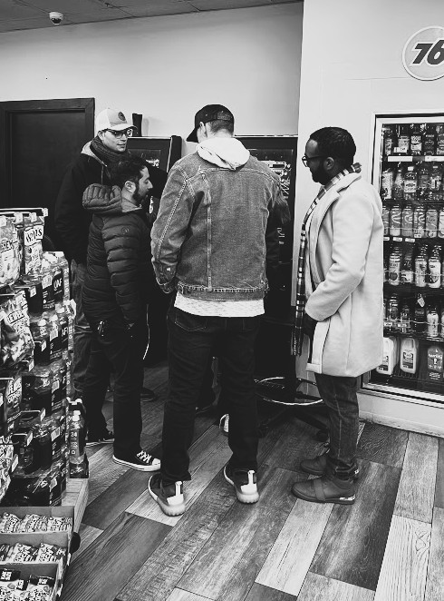
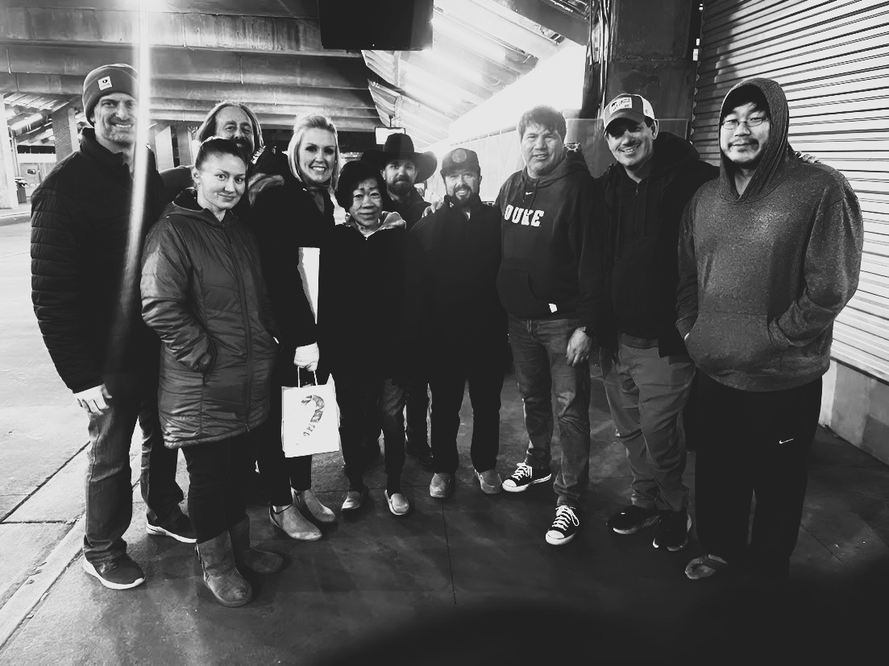

import RefreshOnFirstLoad from '@site/src/components/HomepageFeatures/RefreshOnFirstLoad';

<RefreshOnFirstLoad />

# DESTINED (2025)

*A testimony of modern-day miracles, supernatural encounters, and raw personal life stories that will leave you questioning the goodness of God in a dark and disenchanted world.*

## Dedication

For the saints

## Quote

> *“In love he predestined us for adoption to sonship through Jesus Christ, in accordance with his pleasure and will—to the praise of his glorious grace, which he has freely given us in the One he loves.”*  (Ephesians 1:4-6 NIV)
> 

## Introduction

This is the start of something. What it is, I don’t know. I think it’s a letter from God. Actually, I know it is. Kinda.

I was led by the Spirit to write my thoughts. I love to write when I know what I’m writing about. This time, it’s whatever the Lord wants. I believe it’s for an audience of one. Maybe you’re the one this is meant for. Hopefully.

This is my story in a nutshell, unfiltered. Unvarnished by what I think it should be or want to put out to the world. There’s literary no agenda here, but I will be saying a few things that will make you uncomfortable. I’m not sorry.

## One

Every story has a beginning. Mine starts when I was young, but not a child. In fact, I believe your life really starts when you first know God. Better yet, when He knows you. We could all say that we know someone, or something about them, but to be known is entirely a different story. That’s where I’ll start.
I’m going to try and avoid using Bible verses or idioms from things I’ve picked up as a Christ follower, but it will be hard. I’m just going to tell my story as best as I can. I know God will fill in the rest.

Where to begin. Hmm. I suppose you could say that my first contact with the Lord started prior to actually meeting Him, but that wouldn’t make sense. Basically, because I believe God can take on human form, like Jesus, and promises to inhabit His people by the Holy Spirit, then I essentially believe people interact with Him through those he indwells. I know I’ve encountered Him through Spirit-filled saints that I’ve met along the way.

Previously to being newly created, or “born again”, I was in the military. I knew there were people I served with that loved God, attended church, and genuinely tried to share their faith. I rarely, if ever, took them seriously. I was a punk, always dodging them in my heart because I had other plans for my life. God, I’m grateful for those people.

In 2013, or thereabouts, I was starting to get in trouble with drinking and drugs on occasion. I was just out of the military then and working by day while attending college at night. My girlfriend was living with me at the time and planned to marry her. I even bought a house to show her that I was serious. It was a dream.

Around that same time, I started to attending church more regularly. A few of the men in my military unit invited me to a Bible study, and figured it was a good place to learn about marriage and family. Sadly, my girlfriend broke up with me soon after I started committing to faith. It was a hard season, one that I honestly didn’t know I would recover from. I was suicidal, depressed, and isolated. Rock-bottom. That is where my story begins.

The first time I met Jesus was in the summer of 2014. I was in a men’s group that gathered Saturday mornings on the same college campus I attended. Just as the meeting began, I briefly caught a deer grazing just outside. It was interesting how that occurred on this particular morning. Once we made introductions and announcements, we began entering into prayer.

Reclining on the couch, I just rested back into a comfortable position. It seemed like just any ordinary prayer gathering. Each of us went around the room sharing our requests to God with gratitude for our lives and hope. It was all very normal. Then, something happened.

I remembered losing track of time. It was like I was in a slumber, only awake in my mind. I knew I was being taken up in the Spirit, and felt a bright warmth drawing me upward. Everything was just light in my being. My mind was clear, without care or worry. Serene.

For a split second, as clear as day, I saw Jesus. He was clothed in white garments. Next to Him was the Father, who’s presence was light. They both were warm and penetrating. At that moment, I instantly knew all the books of the Bible were true. It was like a direct download into my soul, which I believe is the Holy Spirit. He is the truth, and teaches us who God is and how to be like Him.

I immediately felt drawn back to my body as the prayer time had ended. Before I could process what I was experiencing, I opened my eyes and sensed a supernatural calmness that I had never encountered before. It was as if I was present, but I had been somewhere else more peaceful and wanted to return. I’ve been chasing that high ever since.

If it had to guess for certain, I was probably out for a few minutes. My friend, Riley, said I had a smile on my face and was glowing. I told him, “Dude. You don’t understand. I just met Jesus. It’s real.” He smiled, as if this was normal Christianity. That season was monumental for me. The Holy Spirit began teaching me the secret things, like rhema words and how to pray in the Spirit, i.e. tongues… but that is for another day. 

## Two

You cannot escape the sins of others. We live in a fallen world where a tangible presence of evil is felt. Even people lacking spiritual discernment instinctively understand the brokenness in the world. They sense it.

What I found about Christianity, or at the least the way Jesus handled tough questions about the heart, made sense of the things I was experiencing. I wanted justice for hurts and pain I had experienced. Mind you, I didn’t want to deal with the actual problems I’ve cause to myself and others. This is the deceptive nature of sin. It’s always some else’s fault, never ours.

*“They hurt me.”* 

*“No one listens.”*

*“No one understands.”*

*“I hate them.”*

On and on, without end. But, I found that end in Christ. He was the ultimate victim, and never ceased believing the best for others. That’s faith: it always loves. There’s much more I could expound on that point, but it’s not important for now.

Shortly after my first encounter with Jesus, I begun committing more to the church. This is how I observed more of God’s ways as He was working in my life. You see, even in the Old Testament, people like Jacob, David, and Joseph among countless others had a backstory to their lives. This was how they were able to make sense of how God was communicating to them. Whether it was through dreams or visions, complicated family dynamics, or even conquering giants, God had unique ways of using their experiences to shape them for their spiritual calling.

The last place I thought I would be as a new believer was in seminary. The Bible college I attended wasn’t some old prestigious university where great preachers of faith made their mark for the kingdom. It was, however, filled with the Holy Spirit.

Before I knew what systematic theology, textual criticism, or hermeneutics were, I was just curious. That, in my opinion, is the best position to be in. Jesus put it this way: *“If you can’t humble yourself like a child, you’re not fit for the kingdom.”*  There, my first Bible quote. See, I knew this would be a challenge.

I am often amazed by the sheer brilliance of His ways. There are too may stories to count of His goodness, even when I felt totally alone and isolated. It’s difficult to recall.

Next to me is a notepad to keep me on track. Story upon story, line upon line, one challenge after another. Dozens of ministries and startups to reach the lost with the Gospel, from books to skatepark outreaches, mission trips, and discipleship in between.

No testimony is complete though without its fair share of disappointments and setbacks. We all like a good comeback story. Let’s see. Where to start.

I first need to discuss my journey of sexual purity. It’s a touchy subject but honest.

Porn. Masturbation. Sexual outside marriage, even as a born again Christian. Yeah, it’s a lot.

Something people seem to forget often is that the Internet, as we know it, is a relatively recent phenomena. Not only are the devices smaller and browsing them more discreet, but the content has become increasingly sensual and ubiquitous. I can go on for pages.

The church I got saved out of had a deliberate space for men combatting porn addiction. Sadly, many churches today still bury it, or at least attempt to manage. Global web traffic stats would say otherwise. To say it bluntly: internet pornography has become a silent epidemic, fueled by increased human trafficking and organized crime reaching the highest levels of political office—and practically no one is talking about it.

The men’s group laid a solid foundation for abstinence, accountability, and daily renewal unlike anything I’ve seen to date. I’ve been in many programs and recovery circles and nothing touches this, even today. It all starts and ends with discipleship.

Time and letter do not afford the immense wisdom and understanding I’ve gained in these circles, but I believe the heart of it was Jesus. God walked among us, bodily, in the raw and sin-soaked world we inhabit. He knew our frailty and inability to cleanse ourselves from this fallen condition. I vividly remembered the shame I carried in church, knowing I had engaged in porn and adultery in my life. My flesh was violent against the Spirit, for lack of a better word, but I was hopeful. I knew Jesus was calling me upward, above the sins and limitations I had carried from birth. I was a new creation, but I didn’t feel like, yet.

## Three

If you’re wondering when the impossible things are coming, keep reading. There’s some build up to this. It’s not enough that Jesus still touches people supernaturally today, but people still insist on “seeing” miracles to believe. I suppose I did too.

I sometimes joke when sharing my testimony. I say, "I started attending church and the last person I ever thought to meet was Jesus.” It usually makes for a good laugh.

If you’re not born again, or born “above”, as the Greek more accurately renders, there’s no hope for your salvation. That’s a sobering reality for many who think they have the right god, but it’s not so easy to digest.

It wasn’t until I was nearing completion of seminary that I learned about how worldviews are formed. I was taking an apologetics course with two professors, both would play an indelible part of my spiritual formation for several years proceeding.

Essentially, I learned that people form most of their beliefs and perspectives by the underlying assumptions of reality they hold. These are generally inherited through ancestry, culture, and various ways of being in their society.

For example, if you’re born in one part of the world with a particular worldview or religious orientation, then you’ll naturally look at life and reality through that particular lens. There’s simply nothing you can do to change that. Obviously, there’s a false idea that people from different walks and backgrounds experience God in unique ways that are equally true. Therefore, Christianity looses.

Let me be the first to state that having studied and defended the Scriptures in my generation for the past decade, on college campuses, marketplaces, and the internet, I am amazed at just how much opposition there is to the Gospel. If Jesus was just another god, I seriously doubt his words would be scrutinized as much. No one curses Buddha or Mohammed when they’re having a moment, but they will certainly blaspheme the Son of God—which is another name for the LORD—who is also God. Yeah, it’s fun.

Now, where was I. Ah, the first miracle.

In the men’s purity group I was attending, a young teenager—Julian—had been attending with his grandpa. Julian was a young leader, pretty versed in the Word even at his age. I was just a few years in seminary myself, and could noticeably see the fruit in his life. However, in Julian’s case, I saw something in him also working itself in unhealthy ways. I vividly recall picking him up several times from his grandma’s house, high, along with a host of other problems manifesting through him.

You see, I was Julian at his age. I was attending church with my family, and smoking weed with my friends, even in the church parking lot after hours. Not including having sex along with a host of issues too numerous for this book alone. However, unlike Julian, I didn’t have the Holy Spirit in me, or at least not in relationship with Him.

After meeting with Julian several times, at his grandfather’s request, I could tell he was a gifted evangelist and song composer. He made YouTubes of his music and tracks, that I would like or comment on to show support. Occasionally, I would pick Julian up from the skatepark and we would talk. It didn’t take long to discover that he was ministering to other kids, dropping Scriptures and encouraging them to attend church.

This may be challenging for some to understand, but I wonder how many Julians are in our homes and churches. Young kids, exposed to sex and drugs, addicted to social media. Those without stable family situations, and yet still eager to know God and to share in His work.

Unlike Julian, I walked away from faith at his age and lived a worldly lifestyle, even though I was doing what my family and society expected of me at the highest levels. I served my country during a wartime, educated myself at its universities, and volunteered for humanitarian causes, but I didn’t have a personal relationship with God.

The COVID-19 outbreak happened during this same period, right around the time of a large men’s gathering near Liberty University. Over 5,000 men attended the conference, with guest speakers like Tim Tebow and Marcus Luttrell, a real-life combat hero. Each real-life testaments to the power of faith in changing the culture around them.

Now, you would think it nearly impossible that a thirty-year old man could convince a 15-year old’s parents to take him across state-lines to a men’s conference, over night, at the height of the pandemic, and yet here Julian and I were on a road trip that would indelibly impact our lives and friendship forever.

What Julian didn’t know was that I had a baseball signed by the men in our group that I planned to give to him the night of the conference. The night of the conference, I presented the ball to Julian as Tim Tebow finished his keynote speech. Interestingly, Tim played professionally for the New York Mets, following his short tenure with NFL.

Upon receiving the baseball, Julian’s face lit up. I secretly told him I wished that I wanted to get Tim Tebow to sign it as well. Before I could finish, Julian ran straight to the podium, bursting past dozens of men and some of Tim’s crew to have him sign it. I was shocked. He eagerly returned with the ball in hand as I marveled at his impetuous nature.

What Julian didn’t know was that I planned to gift him that ball following his first semester of college. That was a stretch at the time, but he’s since completed a few courses of seminary, and is now married to a lovely young woman of God who ministers alongside him.

Excited as that day was, nothing prepared me for the following afternoon with Julian. What I saw would not only shape my ministry trajectory, but has changed the eternal destinies of countless young souls today.

## Four

After the morning breakout sessions were over, we decided to hit the streets of downtown Lynchburg Virginia. Since meeting Julian, I didn’t realize how ubiquitous the skate subculture was in America. For example, most cities have a local skatepark near downtown. Some are funded by the city, while others are managed by a community of volunteers, mostly local skaters. It’s their world.

Julian pleaded for us to visit the skatepark, which I accepted on the condition that he visit the Liberty University campus later that afternoon. I already felt like a guardian figure to him, and promised his mother I would look out for him—including his future education.

I dropped off Julian at the skatepark and walked around observing the other skaters. I was amazed how people could manage to land tricks on their boards without falling. Growing up in California, I saw how vibrant the skate culture was. Everyone had a pair of Vans or watched X-Games to see Tony Hawk go for a bigger record. That was my generation. Today, the cost of a skateboard is still around the same, and the demand just as great.

I briefly headed to my truck to check on a few text messages. Several minutes had passed before I realized the next conference speaker would be starting soon. As I looked toward the park, my heart sank at the sight of Julian surrounded by at least four young people, each with angry faces heckling him. I quickly ran up to him, but paused when I noticed what he was doing. Here we were, in the weekend of a men’s conference at the height of COVID, and I observe Julian surrounded by a hostile group of kids trying to destroy his witness. I was tempted to intervene but I couldn’t help but to marvel at the sight.

At this point in my walk, I had already started to share and defend the Gospel with coworkers, neighbors, and everyone in between. However, what I witnessed at the skatepark that afternoon was a young man bolding standing for Christ amid his peers. Fellow skaters stopped to watch the episode ensue. It was clear several of the skaters were harassing Julian, some commenting on his outward appearance while others wanted to cherry pick his theological perspectives.

I vividly recall speaking to one of the kids, Luke, who critiqued Julian’s approach, saying he was actively speaking out on LGBTQ issues while other students wanted to tackle the nuances of psychedelics, evolutionary theory, and other issues they may have picked up in the culture. Some of the youth were clearly caught up in the world, while others were raised in church but faced brokenness from divorce and dysfunction. Unlike his peers, though, Julian kept the faith and shared his testimony despite his moral shortcomings. That, in my view, is what God honors most.

After leaving the skatepark, we did an after-action review on what happened. It was something we would later do after every evangelistic outreach. What did we see, what did we learn, how could we do it better? This time though, instead of critiquing Julian’s approach, or commenting on ways to improve, I simply told him I was proud. He is the David and Stephen of his generation, willing to be harassed, beaten, and trampled on for the faith. The world is not worthy of such.

## Five

Daniel Brown. Not the author of “Da Vinci Code”, but another man I know. There are few people I’ve met in my journey who have noticeably stood apart. I could say a lot about the many pastors, friends, and brothers in Christ—and I will. However, Dan was the exception in my early spiritual formation.

I met Dan through a mutual friend, and was amazed by his depth of knowledge. He was noticeably set apart, in character and maturity. Dan was likely a savant. The kind who literally knows 90% of jeopardy questions, but who struggles in a traditional 9-to-5 jobs. He was a carpenter by day, and Bible teacher at night. His story of entering pastoral ministry is one I hear of on occasion and still brings me pause.

After a moral failing from their shepherd, the church board elected Dan in for his character in maturity among the flock. He pastored for eight years, and stepped down when his time was up. It’s one of those stories you hear that makes you consider what it means to truly serve and lead. Often we assume the person up front is supposed to do that their entire life, and their children following. Yet, there are times when God appoints the right person to shake up up and transform entire communities for generations. More on that when I get to Marcus, another hero of the faith who emerged out of similar circumstances.

Shortly after meeting, Dan invited me to his small group gathering at his house along with several of his neighbors. Some of the young people in his fellowship he had been pastoring in his former church, including their parents. At this point, I was about halfway through seminary, and pretty active in discipleship but 

Dan’s group was noticeably different. He instructed us to bring a notepad and Bible the first day, and nothing else. We didn’t pray or get into side bar conversations. Once seated, Dan opened to a Scripture and we dove in. He would pose a question from the text, which we would write it down and find the references to for study and meditation. The youngest of the group, just barely out of High School, was examining the Scriptures and rightly applying sound Biblical interpretation. There are small groups and fellowship gatherings, and there was Dan’s house. I grew more in that fellowship in knowledge and understanding than in many years preceding. 

Much of how I do life and discipleship with people has been shaped by experiences with complete strangers in the world but brothers in the family of God. When you exist in these tightly-knit circles you see just how radically different the call of Christ is in the saints as opposed to the worldly Christianity we often see at present.

The reality of the times we’re in is reflective of the state of true relationship Christians have with Jesus. The culture thinks little of the Christian ethic and it’s ways regarding family and marriage. Popular influencers and thought experts like to jabs at Jesus’ words, or cherry pick controversial verses whenever it’s politically convenient—often with little care to properly examining the context. If we’re being honest, most Christians even treat prayer and Bible study as chores we’re doing while waiting for our glorified bodies in heaven.

I’m grateful the Lord has taken me through the deep and painful process of sanctification, fleshing out all the iniquity out of my members. It’s pure selfishness and pride that’s let me to this point, and yet His nature in me is working far better things than I can ever think or imagine. It’s easier to say no to sin and temptation the more you say yes to Jesus. My brothers and sisters in faith encourage me to push beyond my comfort, and its their suffering for the Gospel that makes me proud to walk alongside them in the trials of life.

Not that following Jesus should be all doom and gloom. In reality, having a full and victorious life implies that you’ve had trials, disappointments, and monumental setbacks that have shaped and propelled you to greater levels of victory. We’ll talk up our goals and achievements on social media, showcasing our family and loves ones, but rarely acknowledge our Creator outside maybe Easter or Christmas. This is unacceptable to a King who gloriously lays down his life for his people, and is subjected to a dusty bookshelf below the pop culture and self-help literature in a local library. Think the Lord of the Universe will bless a nation that treats him that way?

A pastor I think said it best. He was interviewing a young man and leader, giving him some sage advice for a young man thinking of entering the ministry:

> “I see so many young people wanting to create this or that, launch startups, and change the world… here’s what I tell them—start first by going home to your spouse or loved ones, be silent as they talk for an hour, and repeat back what they say without offering advice—learn to do that first before you try and help other people with their lives.”
> 

Yeah. That still hits hard.

## Six

There’s many times I wanted to say 

A big part of my story is mental health. Trauma affects everyone differently, but for me the mental assaults are particularly difficult. I need to constantly be in the Word, because constant thoughts and ideas will swirl through my mind leading me to sin. I’m convinced that not everyone has this same problem, or at least to the same degree.

My first interaction with Bill came after separating from the military. My father had passed on or around that same season and I was in need of heavy counseling. It’s difficult to think about now, but at the time it was one of the most challenging experiences of my life. Bill was a counselor and friend. It’s amazing to think how for years you can visit someone, unpack layers of trauma potentially stemming back generations.

I’ve been through numerous healing ministries, intensives, and mind renewal sessions but noting seems to replace the one-on-one connection with others. There’s vulnerability in sharing and receiving between friends. I believe this is the pattern for all healing, spiritual or otherwise.

I heard a friend say something that radically changed my perspective on the shame and wounds we carry:

> “If we walk in love, there’s no place for fear.”
> 

There’s nothing we can’t do when loving God, others, and ourselves. Will people reject us? Yes, and often, but they’re not rejecting us rather the love that is within us. However, if selfishness gets in the way, then we’re no walking in love, but in fear.

This probably sounds basic for some. In concept, certainly, but in practice, painful. That’s why we can say we’re following Jesus—living moral and upright lives—and actually missing the mark. We don’t put the truth into practice, and relate to it. That’s the ancient way.

God’s people learned this by dwelling in tents, moving from city to city, and following the Voice of His prophets and messengers. Through trial and circumstance, plagues, famines, and wars, God brought His people out from the darkness.

Today, we learn to listen to His voice by the Word. It’s no different, but the promise is better. That is the hope that enables us to heal past wounds, press on through setbacks, and overcome by the spirit and power of God within.

Time after time again, I’ve learned to listen and trust God’s Word no matter what. To everyone around you, obeying God looks like complete foolishness. I’ve had family and friends correct me often, people say that’s not how this and that works, and in some cases, “you’re wrong or deceived.”

There’s a place you have to go to often in the Lord that will separate you from all others. I believe King David understood this most, and countless others who’ve experienced the dark night of the soul.

For me, I’ve been in places having to deny the most tempting situations, and manifesting through it. You don’t know how much you love the world until your heart’s desires are exposed and ripped out of you. Many times I’ve been on the floor screaming and praying through tears to have him take it from me, but he would kindly say, “My grace is sufficient for you, for my power is made perfect in weakness.”

This is the narrow path. Many people want the good, blessed life, and don’t know what Christ really came down from heaven to accomplish on the Cross. We were dead in our sin, strangers in a strange home that’s not our true home. I’m getting preachy, but it’s just the truth. Until you taste eternity, everything else falls woefully short of eternity.

As of writing this, I’ve discovered just how easily anger can manifest. Road rage of the heart. Sometimes, I’m surprised by what comes out in the moment. Everything evil comes from within, and must be supplanted by a superior force: love. No negotiation. Love triumphs over evil.

I can honestly attribute most of the problems I’ve incurred because of this anger. More like self-protected self-righteous anger. It’s demonic.

With the Lord’s help, I will conquer this feeling. Wait, I already am. That’s it!

## Seven

Know as I’m writing this, I live a pretty good middle class life in America. Many, MANY, people in the world do not live like people do here. If you were born in a slum in India, you would have a much different perspective for destitution than we do here. This is how most people throughout time lived, and still do today. Throughout my travels, whether the Middle East, South America, Europe, or here at home, there is a consistent need I’ve seen that supersedes that of material poverty.

The lasting provision and hope people are desperately in need of Jesus. What I mean by that is, the heart of the Gospel message is the “Good News” that we have hope in this life and the next because Hope itself came from the next life to us. We’re returning from the place we first started, but that begins now, today.

I didn’t understand this concept fully until I started to read the Bible for myself and put it into practice. There’s a difference between knowledge of something, and knowing something intimately. An example of this could be a relationship or marriage. In essence, you could be married on paper, but not truly in love with the person. To love someone is to get to know them, and to keep learning who that person is.

When I was an early Christian, I would spend hours soaking in the presence of the Lord. I must have read through the Bible at two or three times in the first few years of pursue Jesus. This was in spite of job and relationship loss, home ownership, and military deployments to the other side of the world away from everything I knew. What amazed me, was not matter where I went, there were other believers experiencing the same thing. I’m not talking about community engagement, but a living and active relationship with the King of the Universe.

God has a way of uprooting you from your comforts to teaching you about His nature. I was in the National Guard shortly after separating from the Army. After a few yeas, I was gaining promotions and advancing in my career. I was even considering military chaplaincy, which I was in school earning advanced degrees to fulfill. Sadly, that dream would never come to pass but something better happened.

For several years I was showing up to drill, staying grounded in work and studies, without the faintest clue of how quickly my life would come to a standstill. I was stationed at the officer training academy for the state, a non-deployable billet and place where people usually retired out after decades long service. It was a sweetheart position, low-stress, and just what I needed after several deployments to Afghanistan.

One day, I receive a call from our operations NCO, informing me that I was being mobilized to Kuwait. It took me a few seconds to process those words, because they didn’t exactly factor into my plans. I wasn’t opposed to leaving home, but not then. Not without a warning ahead of time. Yeah, that’s not how things work. It turned out someone else was slotted to deploy, and I was going in their stead. Now, here I am, in a position that wasn’t supposed to be, in a unit that doesn’t deploy, being sent to a place and people I don’t even know. That’s how God works.

Much could be said about that trip to Kuwait. I had not suffered to date such opposition to Christ, but had also not experienced such profound moments with Jesus either. I was away from my home church for the first time, and started to encounter the broader church in a land not my own.

The base chapel hosted religious services for Muslims, Jews, Catholics, Mormons, and the like. It’s interesting sharing a worship center with people of diverse cultural backgrounds, but try living among them daily for over a year. Our living quarters was an open bay separated by a thin sheet of blanket. I could hear my soldiers cursing me under my breath just as I knew they heard my prayers for them.

That tour broke me in many ways, challenging my faith in light of clear opposition to the Gospel. I received threats to my life, had my position stripped and junior leaders placed over me to teach me a lesson. One of my soldiers was sexually assaulted by another leader, who had no business placing him above her. I felt utterly powerless to do anything about it, but God gave me strength to stand up to them.

Towards the end of that trip, I was spiritually drained. I felt like no one understood the trials I was experiencing. Like David, I experienced the dark night of the soul, only here I was cut off from all family and sense of normalcy.

Following a small group meeting, one of the last of the deployment, I found a few guys studying in the back of the chapel. One of them was a young man, Mickey, who I distinctly remembered carrying a Kin James Bible, and swore by no other. There were several young people he did life with that trip, and was soon invited into their study group. It was exactly what I needed. They would spend hours in the scriptures practically each night. People were receiving the Holy Spirit, and sharing testimonies of healing and deep transformation. One of the guys in the group never even read a book before, and was learning the Bible for the first time. He testified that he got through school just learning the back of a book and writing about it. I literarily couldn’t believe it when he was reading whole sections of Scripture, and stumbling through some of the Hebrew names.

Another solider in the group shared a story equally compelling of how just before deploying, he was a witness to his own daughter’s perpetrator following a sexual assault. He confessed in tears how he never shared that with another soul outside his family, as the events were still vivid even years later. “Had I not been saved at the time of the court hearing,” he recalled later, “it wouldn’t been me in cuffs.” He confessed that the Holy Spirit supernaturally protected him from taking another man’s life on the spot.

Though several years have passed, I still remembered these accounts clearly (Attach photo). What I discovered about Mickey was that from the moment he stepped on the ground at Kuwait, he ministered to practically every person in his unit, and began discipling them slowly. The key to his success, I found out later, began long before he had boots on the ground.

Before deploying, Mickey would volunteer his time at a young detention center. He wasn’t allowed to bring in his Bible due to security reasons, forcing him to memorize Scripture to share with inmates he was ministering to. You see, Mickey was a meth addict prior to being saved and later joining the military. He could’ve easily been in those prisons, or dead, and yet decided to use his testimony to reach the lost in the darkest places. That’s preparation is what led him to success in the military, with the austere conditions we faced. God backs faith and honors the disciplined.

Those last few weeks of the trip restored my soul from the pain of the previous eight months combined. God came through for me and others, birthing entirely new opportunities and futures before our eyes. He took the prisoners, set them free, and used them to liberate others in bondage. 

That’s who God is.

## Eight

> “When you look for Jesus, you find Him everywhere.” ~ Unknown
> 

We all carry footnotes in our lives. Either moments of shame or guilt, while others stories of encounter that could only be understood in retrospect. Sometimes, they are the memories we don’t want to think on, or have stories written about.

My footnote came from an unsuspecting encounter with a man who I met through a mutual friend. I normally wouldn’t take this person’s advice, but after multiple nudges, I decided to follow-up.

Aaron, or P.A.—short for Pastor Aaron—was a middle-aged man who had spent a lifetime mentoring young men. To date, he had counseled over 5,000 men, and has a gift for ministering to them unrivaled by anyone I’ve met.

Without going into his backstory, I believe what God has done through Aaron’s witness was turn a mess into a message. By that, I mean that despite P.A.’s personal character shortcomings, he is faithful with what the Lord has given him. That’s not a light statement, considering most “Christians” are content to live under the banner of grace, while doing the absolute bare-minimum in their walk. However, God backs faith.

I personally supported and benefited from Aaron’s ministry, whether his intercessory prayer, encouragement, and even taking “vacations” with him in the Spirit—something only people who enter into his ministry would understand.

The impossible thing I encountered with Aaron, though, was not his deeper-level discipleship or mentoring strategies. No. It was when we had a profound falling out due to serious moral and theological issues over giving. In a nutshell, when any person or ministry pulls that thread often and increasingly, it’s typically a sign of another spirit in operation.

After a difficult disagreement, my heart was torn. I loved P.A., and wanted him to understand why I wasn’t willing to support his ministry anymore, I sensed the Lord leading me to forgive him. I totally felt used, emotionally and spiritually manipulated, and justified in calling out his sin. However, God has a different set of protocols for how He wants sons to treat each other.

You see, I believe that when we say we love God, we have to obey all His words. This includes those commands that say we must love our brothers as ourselves, forgiving those who are made in His image, but especially those born in the Spirit. It’s easy to forgive sinful or lost people, because they are not genuine believers. However, it’s quite another to show mercy to fellow brothers and coheirs in Christ. That is why Jesus had a separate set of moral standards He expected his followers to obey—read the Sermon on the Mount (Matthew 5).

All this to say, even though I needed to separate from P.A., I knew in my heart I had to forgive him for the hurt he had caused me. This is the mark of sainthood. There’s no other option. We may separate for a time, and in other cases we release them back to God, but more often than not God causes some of those same people to cross our path again.

I honestly believe the Lord wrote our story from beginning to end. Actually, I know that He did. It’s in the living that’s the hard part. His ways take us places, deep within, and without. I’ve been crucified with Christ. I’m a new creation in Christ. Over and again, there’s this consistent theme in Spirit. *I’m with you*.

To date, I haven’t spoken with Aaron. I once sent him a friend request after some time, but I never received a reply. It’s okay, and if he reads this, know that I hold no bitterness. I pray you feel the same. In fact, if anyone is reading this now, forgive the person in your life that has caused you pain. The more you walk in that forgiveness, the more you’ll experience freedom. It’s that simple. We don’t do it, because we want to stay victims or demand justice. That’s the old nature in Adam.

There are no more victims since Christ. Everyone of us has a choice to love and forgive, even those who have caused us pain that demands justice and acknowledgement of guilt—and they should—but we don’t become the judge.

This is the narrow path. The road less travelled. The way to eternal life. It’s through Him. It is Him.

## Nine

New Bethel Church was the last place I thought I’d wind up in my walk. I came up in a non-denominational church environment with Calvinist roots. My theology, experience, and practice were rooted in discipleship systems and church multiplication. However, God had other plans for my life.

By this time, I had broken up with my girlfriend—another devasting loss—and was navigating life and ministry. I was involved on the college campus at NC State, and actively pursuing ministry. It’s painful to think about how many relationship setbacks and disappointments I’ve faced since following Christ. I don’t think without His help I honestly would’ve survived this long. You grow each time, I suppose.

The biblical definition of a miracle can be defined as “an event or effect contrary to the established constitution and course of things, or a deviation from the known laws of nature; a supernatural event.”

Me and several church members at New Bethel were doing evangelistic outreach in our community. I distinctly remembered forgetting my wallet before leaving the house that evening. I never forget my wallet. However, the Lord reminded me that He would provide for me if I so needed it. This was already taking me out of my comfort zone, since I love to situationally bless people by paying for their coffee or groceries when they least expect it. I’ve found this still to be one of the best ways to start a Gospel conversation.

“Ok, God. I don’t have my wallet and you want me to trust you with not only taking care of me, but also the people we’ve come to minister to,” I recalled in my prayers on the ride to our meet up. Once I arrived, we canvased the nearby area, occasionally driving to different locations as the Spirit led. Meanwhile, I had the nagging thought in my mind that I didn’t have any means to pay for things. What if we got arrested and needed to provide identification? “That’s what God wanted me to do,” I thought to myself. “Tonight, we’re going to get arrested for Jesus,” I contemplated while praying for strangers and laying hands of healing at a local gas station. Really, Jason? Get arrested? That’s a stretch.

As the night continued, my associate pastor Nick was inside talking with a gentleman playing a semi-illegal slot machine while drinking a 40. By this point, I was a little tired from ministry and was starting to get late. However, the zeal of my fellow saints spurned me on to good works. I eventually joined up with Nick as he was speaking with this older gentleman. The man was apparently a believer but had backslidden much in his life. While he was pressing the spin button to the electronic slot machine, Nick asked him how we could pray for him. I could sense in my spirit the man was being oppressed by something heavy or demonic, but he continued to say how troubled his life has been because of his poor decisions. He was down on his last few dollars, which he hopelessly poured into the slot machine at the back of the gas station store.

What was fascinating about this gentleman was that he could cite whole passages of Scripture by memory. Literally, we’re trying to minister to fellow brother who has entire sections of Psalms and the prophets memorized and yet is in the struggles of poverty and addiction.

“How can we pray for you brother?” Nick continued as the man lamented with tears in his eyes. He responded that he needed to get his heart right with God and to commit to going back to church. We immediately laid hands and prayed for him as he continued gambling with a few remaining credits. Then, suddenly, I noticed something on the gambling screen in front of me. With each press of the button, the gentleman continued to win. It started off small, but then the next pull would line up three glyphs on the horizontal bar, resulting in an immediate reward. Several successive pulls later, he went from having $2 to over $100. That’s a nearly 5000% increase from his initial deposit. The statistics alone of hitting that many consecutive pulls is astronomical, but the fact it happened at that moment with Nick and I praying for him was even more astounding. As I noticed what was happening before my eyes, the man began crying, having recognized that despite receive a generous reward, he was spiritually bankrupt.

After praying, I was reminded of the fact I forgot my wallet. I could sense he was still reeling from the moment, and explained to the gentleman that I too was disobedient in my past, not trusting in God’s mercy and provision. I proceeded to empty my pockets and show him that I came with nothing but the Gospel of peace. With a determined glance, the gentleman printed out his winnings from the slot machine and headed to the cashier. He then asked for two fifty-dollar bills, one of them he placed in his pocket and the other handed to me while responding, “There is your reward for your service.” My heart sank. I was instantly reminded of the Scripture where Jesus sent out the twelve:

> *“Anyone who welcomes you welcomes me, and anyone who welcomes me welcomes the one who sent me. Whoever welcomes a prophet as a prophet will receive a prophet’s reward, and whoever welcomes a righteous person as a righteous person will receive a righteous person’s reward. And if anyone gives even a cup of cold water to one of these little ones who is my disciple, truly I tell you, that person will certainly not lose their reward.”* (Matthew 10:40-42 NIV)
> 

Humbled by the episode, I was reminded why I didn’t need my wallet that evening. God was teaching me a valuable lesson about his nature and timing. You see, for years I had avoided doing the one thing I know He called me to do, which is to trust him. Trust him that He would take care of me and provide even as I step out on faith. Like Jonah, I avoided the nudges to go, wanting to do ministry on my own terms. I wanted a wife, a family, a church, and generous support team to send me into the mission field, but instead he was calling me in the condition I was in—a single, middle-aged, man with a great paying career and all the luxuries of an American lifestyle.

Demographically, raising support as a single white man must be the most difficult thing to do in our culture. I can already hear the flood of concerns from would-be partners, “Why can’t you work a day job? How will you provide for a family? Why isn’t your church sending you?” These were the exact same questions I heard over the dozens of engagements I had with family, close friends, and strangers who I tried to share my vision with. These same people, many of whom profess Christ and who I loved and supported through life struggles, divorce, wayward children, and the like would barely offer a cent to support the cause. And what was the vision? To reach the young, the lost, and hurting of our culture.

Now, before I say more. I’ve learned a great deal of humility since I began this journey. Many of these same people I hardened my heart toward, I had a chance to repent of later. I’m grateful for that season of rejection, because it revealed so much pride in my heart. Granted, I wasn’t just another charity spamming them for donations. I was somebody they knew, who they could attest to my genuine faith and was Biblically educated to deliver when called upon. Someone they could trust to steward their offering toward the Kingdom of God with integrity. However, most of my interactions were met with neutral to critical feedback, and in certain cases, a loss of communication.

In time, I eventually discovered what the true problem of my support raising failures were, and it came from an unlikely source.

## Ten

God speaks in symbols and patterns. I think He knows that humans aren’t the best at taking directions. I mean, if you tell someone to do a thing that’s foreign to them, they’ll typically do the opposite. Why? Because of fear.

Countless times Jesus informed people to share—or not share—the message or miracle they had received, knowing they would defy him. I can relate to this in my own life, whether it was entering into a romantic relationship, choosing a career, or even purchasing a vehicle. He knows my heart.

Often, I only learn in retrospect what He was up to from the beginning. You see this often in the Bible, where God would send people to specific places where they would encounter something or learn a hard lesson. It’s usually afterward, they would name that place, situation, or even person after the very thing they encountered, like Peniel, Gethsemane, Shiloh, Mahanaim**,** etc. For me, that came in the form of two churches: Bethel and Hosea.

I’m going to fast forward to a later time, only because there’s really no set agenda. I’m simply trying to explain how God has moved in my life in unimaginable ways. He is alive and personal.

The leadership at Bethel, specifically pastor Marcus, taught me the *ways* of God unlike any other place I’d been. There were significant gaps in my character that needed improving, along with spiritual disciplines foreign to me. For example, I knew about fasting but was never in a culture that practiced it corporately. The same could be said about speaking in tongues, Gospel evangelism, and intercessory prayer for demonic deliverance. Much of these biblical practices are largely ignored in today’s churches, or tucked away into a backroom somewhere among the spiritually initiated.

This all to say, when you’re practicing a lifestyle of these disciplines, you also open yourself up to a host of other things. I hadn’t experienced more spiritual oppression and resistance in the flesh than at any other time than while attending Bethel. The community taught me how to be “God’s son, man’s servant, and the devil’s master!”

At some point, not sure when, but things started to get hard. There’s a way in war where an enemy realizes that without superior force, ulterior methods of attack are employed. 

Spiritual warfare is one of many ways the enemy has tried to destroy my life and witness. He tries to wear you down with disappointments, fear, and envy especially when prayers and promises are not answered in your timeline. I’ve been taken out of the fight so many times because of relationships, situations, and desires that are not in agreement with God’s plans for my life.

When you know the Father’s heart, you know your destiny. You can see how much the world so deceived because they don’t know the love of the Father. They see it lived out, and profess to even walk it in, but people who daily encounter the living God walk a different path. There’s a humility and grace to their words, things I’m learning and relearning now.

I believe God’s greatest works are displayed most vividly when His children repent. I’m not talking about when a lost sinner finds Christ. Angels rejoice over that. I’m talking about people like Jacob, David, Peter, and Nicodemus—those who know of and have encountered God, and turn their back on Jesus only to return later with greater love and devotion.

The heart of the Gospel is the Prodigal Son story. It’s when a believer recognizes the error of their ways, turns back to God, and receives acceptance and salvation. This is afforded to God’s elect, chosen before the foundation of the world to inherit eternal life. It was is an undeserved grace, but one with a hefty price tag. Hosea Church taught me what that looks like, to a degree.

I attended Hosea for a time following a lengthy season of spiritual warfare. To be honest, it was a break from Bethel’s Charismatic-like culture. Like most stories, I chased after a bold and beautiful woman of God, only to discover her church was far from the yuppie-filled churches in the culture. Hosea was young and reformed, but packed a punch. They lettered in church obedience and discipline, which I had no experienced for some time since I was an early Christian. It was on the opposite end of the spectrum from Bethel.

Pastor David was a gifted teacher and theologian. Unlike Marcus, he led Hosea in a more structured service with little glamour. I believe he was intentionally going anti-seeker friend church. No live-stream services or replays. Verse-by-verse preaching with little opinions or speculation. The pure-word, and could he preach. My friends who’ve attended since would agree. Everything was going great, with plenty of opportunities to meet young Godly women. There was just one glaring problem for me: the Holy Spirit.

## Eleven

While attending Hosea, I couldn’t shake the feeling of my sudden departure from Bethel. It wasn’t an easy break, I confess. I can see how the Lord was teaching me His ways through adversity and delay. Nothing has come easy following Jesus. I cannot think of actually anything good and right that has come seamlessly by following the Lord, but I also know the fleeting pleasure and loss of peace by not following.

The first week at Hosea, I ran into a young man and pastor, Landon. He’s a bold saint of God with a shepherd’s heart. He reached out, and in. There were leaders there, much younger than I, but with a deep reverence for the Lord and His people. The other, more obvious, aspect of the community were the countless beautiful young women I encounter.

Coming from military communities and the country, it was a refreshing change. The first life group I was invited to had over a dozen of them. It was touch to to be there, but not spiritually. Over time, I began to focus less on the outer and toward appearance. It’s another way the Lord has taught me how to love and listen. Many times I was checked and corrected being there. Painfully necessary.

Several times Pastor David preached, I was sensing the conviction of the Spirit. The church was one year two of their church plant, and still in the Gospel of John. They were in no hurry, but I was. On several occasions, David spoke right to my heart.

> “If you’re not where you’re supposed to be… it’s going to be hard.”
> 

Immediately, my Spirit quickened. It’s one of those things you experience often when God is trying to communicate to you something important. The nudges are less frequent, but always on time. I think He knows my heart. He’s in there.

It’s honestly surprising that He forgives my sin at all. I’ve done so many selfish things in life, not to mention my thought life. If my motives were put on trial. The verdict would be guilty. His mercy knows no limits.

Throughout the season, I would receive many calls and texts from family at Bethel. It was strange, and no like anything I had experienced from any other church community. There was often times I would ignore the messages, or respond with generalized details about my departure. It didn’t take long to realize that my absence was tangibly noticed.

Something that you wouldn’t understand apart from God dwelling within you is when you grieve Him. We’re specifically commanded not to quench the Holy Spirit, and yet each time you separate from other spirit-filled believers, you cannot help but to feel a loss. Most times, it is because of personal differences or wounds—these are common even among all people. However, there are those times of immense spiritual division over matters of conscience that whole lives and communities are shaken over. I’ve encountered such instances several times throughout my walk, and they’ve always been because of people or situations that have challenged me to forgive or show mercy in unimaginable ways. Times where we should’ve had justice, but we’re compelled to show grace. Giving what we didn’t get.

The “impossible things” I’ve encountered more often in life and faith are not miraculous move of God, the supernatural things that manifest, or even the spiritual breakthroughs of understanding and experience. Great, those are. No, it’s the times when we forgive those who have wronged us, turn the other cheek, and love when we want to hate and separate.

> *“I tell you that in the same way there will be more rejoicing in heaven over one sinner who repents than over ninety-nine righteous persons who do not need to repent.”* (Luke 15:7 NIV)
> 

## Twelve

There are many ways which God can move in our time and space. I’ve observed one such way, but it often comes at a great cost. To better say it, I believe that to see impossible things you have to sometimes go against the grain. It means defying the established patterns of tradition and conformity and boldly speaking for truth. This is how faith and resilience are developed in a person.

The first time I observed this vividly was on a college campus. It was my first time ministering out in the open, beyond the walls of the local church. My college professor, Dr. Leo, was an experienced campus minister who first showed me the ropes. Up until this time, I never knew you could go out and just share your faith with people.

*“What if I get it wrong?”*

*“Will Jesus be mad?”*

*“Maybe they’ll reject me.”* 

*“How do I respond to their objections?”*

That afternoon, we engaged with several students, each with different perspectives of God, faith, truth, and love. One student, in particular, was particularly receptive to the discussion. My professor carried a small pocket Bible in his back pocket, and after starting with some leading questions, he asked the young man if he had read the Bible. In just a few moments, Dr. Leo skillfully pulled out the Bible and placed it in front of the young man, carefully directing him to specific scriptures with his finger. To my amazement, the student began reading aloud verses from 1st John, Romans, and other passages on salvation as I marveled silently at what I was beholding.

> “If you want to catch a fish, get good at reading upside down.”
> 

 Up until that point, I had never knew you could just minister to people like that. Most of the outreach and ‘evangelism’ I had done at that point was through the local church, and even those were mostly surface-level. This was different. It was like going on a mission trip to a far away country, except the people were at the community college up the road. They too were in a world of their own, with its own language and culture.

Only the Lord knows how many young people’s lives were impacted between 2020 to 2024. Thousands, possibly, all because myself and others decided to launch out instead of hunkering down. Churches and ministries were shutting down but the Gospel was not. Even though we were in a global pandemic, countless souls were engaged and transformed by the power of the Spirit working in us. It was a divine window that I haven’t seen to date, and may not see again until the return of Christ.

Sadly, the fear of failure and rejection has kept many people in the pews, and even more from ever taking steps. The fault is with the church, alone. We make it too easy to come each week and do the bare minimum. It’s turnkey Christianity.

> “When Christ calls a man, He bids him come and die” - Dietrich Bonhoeffer
> 

In his critically acclaimed read, *The Cost of Discipleship*, famed Christian martyr and pastor, Dietrich Bonhoeffer lays out arguably the most comprehensive examination of Christian discipleship outside the Bible. The reason I mention it, is not because of any major theological point I’m trying to drive home, but the seismic nature of what God calls you to when He saves you and indwells you bodily.

There are many—many—times I do not want to obey God’s specific will. On many occasions, the Holy Spirit will prompt me to speak with strangers, give money to specific people—sometimes large amounts—or tell me to go, sit, stand, walk, talk, listen, learn, be still, be silent. Imagine all the the things you would do in a normal human relationship, but amplified. This is normal Christianity.

As I’m reflecting on these times, I can’t help but to think how amazed I am of Julian’s growth. Discipleship isn’t just teaching the Bible and helping people to know Christ, it’s being there others when people it matters most. It’s watching people loose friends and family, comforting them in their trials, and picking them up from rock-bottom. Not everyone is going to let you in, but the true miracle is when they do, all the way to the core. Then, you get to se

I recalled when Julian first encouraged me to ride a skateboard. Here I was, 35 years’ old at the time, doing life with a guy half my age and yet still being challenged to step outside my comfort zone. He was a good young man, but a lot of pain was underneath. Lack of fathering, lack of accountability, and no structure. He was like me, inside, even if I had letters and good paying job on the outside. Inside, we all needed Jesus. There were many times I wanted to write Julian off, but God reminded me often, “My grace is sufficient for you, for my power is made perfect in weakness.”

I still have the moment recorded when I first rode a skateboard without falling. We recorded it skating documentary where Julian and I evangelized and saw the hand of God move in our generation. I’ve still never fallen to date in my short tenure of skating. Not once. Impossible?

<!-- Blue Letter Bible Script Tagger -->

