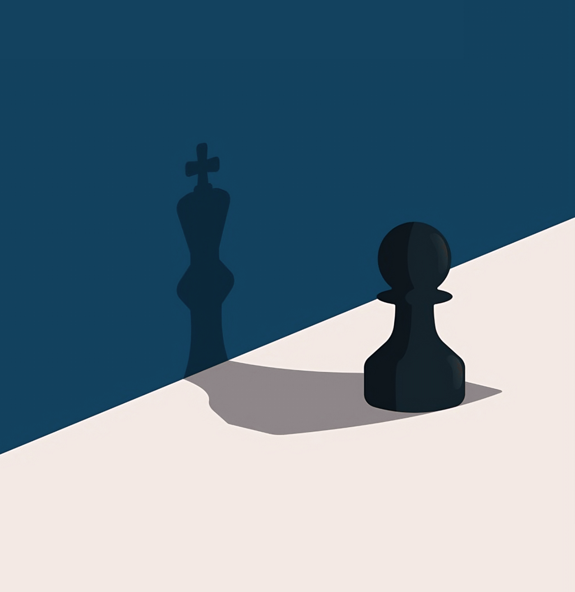

import RefreshOnFirstLoad from '@site/src/components/HomepageFeatures/RefreshOnFirstLoad';

<RefreshOnFirstLoad />

## **Introduction:**

*A piercing examination of lust’s spiritual cost—and the radical purity that reclaims everything it tried to steal.*

## Quote

> *Flee the evil desires of youth and pursue righteousness, faith, love and peace, along with those who call on the Lord out of a pure heart.*  
> — 2 Timothy 2:22 (NIV)

## Introduction

This is not just another teaching. It’s a warning. A wake-up call. A love letter from heaven to the heart that’s quietly exhausted from compromise.

What you’re about to read isn’t filtered or polished to be palatable. It’s direct—because the stakes are eternal. Lust is not just about the body. It’s about the soul. And the enemy has mastered the art of seduction masked as self-expression.

So if your prayers feel dry, your vision foggy, or your walk inconsistent, maybe this is why. Maybe what you think you’re managing is actually managing you.

This is the war within.

---

## The Hidden War: How Lust Enters the Soul Without a Sound

Lust doesn’t kick down the door. It doesn’t roar. It whispers. It creeps in quietly—through a glance, a scroll, a fantasy. It enters dressed as comfort and leaves as bondage.

The war begins in the imagination, not in the bed. That’s why many believers feel spiritually numb without obvious sin in their lives—they’ve opened the gates through moments they’ve excused as harmless. But spiritually, everything has weight.

Demons don’t need your permission when you give them your attention. Every lingering thought is a seed, and every seed grows. Maybe into shame. Maybe into numbness. But always into something toxic.

This is not just temptation. It’s an ancient strategy: defile the imagination, weaken the warrior. And if lust owns your thoughts, it doesn’t need your body. It already has your authority.

---

## The Illusion of Pleasure: How Lust Masquerades as Love

Lust never enters labeled “danger.” It comes with flattery, attention, and excitement. It mimics love just enough to confuse you.

But love builds. Lust drains. Real love leaves you full; lust leaves you haunted.

It’s not just an act—it’s a mindset. A hunger for validation dressed as intimacy. A chase for comfort that costs your clarity. You’re not bonding; you’re leaking. Leaking trust, purpose, power.

And the scariest part? Lust will have you believing that being wanted is the same as being loved. It’s not.

---

## Ancient Betrayals, Modern Addictions

Lust is as old as Eden.

The serpent didn’t offer rebellion; he offered knowledge. Curiosity. A "what if." And from that seed, humanity fell.

Samson fell too—not in one night, but in many little moments of compromise. He didn’t lose strength when his hair was cut. He lost it when he stopped guarding his heart.

Today’s serpent just has Wi-Fi. Lust has new tools, but the same trap. Same loss of power. Same hollowing of authority. But you don’t have to repeat history. You have Christ in you. You have the power to say: *It stops with me.*

---

## Spiritual Sabotage: What You Lose Every Time You Give In

Lust is not just about pleasure. It’s about spiritual theft.

Every indulgence is a trade. You trade clarity for confusion. Peace for torment. Discernment for static. You feel alive in your body but dead in your soul.

You lose time. Energy. Confidence. You lose boldness in prayer. You stop hearing God not because He stopped speaking—but because you can’t tune in anymore.

You weren’t made for casual compromise. You were made to carry glory.

---

## The Jezebel Code: Spirits that Seduce, Sabotage, and Silence the Chosen

The Jezebel spirit isn’t about one woman. It’s about a demonic strategy. It targets the prophetic. The called. The anointed.

It seduces emotionally and spiritually—disguising itself as love, attention, validation. It whispers lies, manipulates boundaries, and distracts your focus until your voice goes silent and your fire fades.

You don’t negotiate with this spirit. You confront it.

You draw lines. You protect your purity. You take back your authority.

---

## The Resistance of the Righteous

The righteous don’t resist by being strong. They resist by fleeing.

Joseph didn’t argue with Potiphar’s wife. He ran.

Jesus didn’t entertain Satan’s lies in the wilderness. He spoke truth.

The prophets didn’t bend to culture. They stood set apart.

Purity is not just about denial. It’s about direction. About choosing purpose over pleasure, and vision over vanity.

---

## The Audacity of Purity in a Pornographic World

In today’s world, purity is rebellion. It’s radical. It’s war.

Everything around you says “give in.” But every *no* you declare shakes hell.

Purity isn’t suppression. It’s power. It restores your ears to hear God, your eyes to see clearly, and your spirit to walk boldly.

You don’t fight lust because you’re afraid of it. You fight it because you remember who you are *without it*: focused, free, unstoppable.

---

## Transformation Over Abstinence: Reclaiming the Destiny Lust Tried to Steal

You weren’t called to white-knuckle through life. You were called to be *transformed*.

God doesn’t want slaves to self-control. He wants sons and daughters who walk in spiritual authority.

Abstinence without identity will fail. But when you know who you are, lust loses its grip.

This is not just behavior change. It’s heart rebirth. It’s the fire of purpose consuming the appetite for fantasy.

Start starving lust with truth. With worship. With a life so full of light, darkness finds no corner to hide.

---

## Conclusion

Now you know: lust isn’t just a struggle. It’s war. And you’ve been targeted not because you’re weak—but because you’re dangerous to darkness.

So fight back. Not with guilt. But with grace. Not alone, but with God.

Your purity is not just your fight. It’s your *weapon*.

---

**Source:**  
C.S. LEWIS SPIRITUALITY. “Why Lust Is More Dangerous Than You Think in Your Spiritual Journey | C.S.LEWIS.” *YouTube*, June 7, 2025. [https://www.youtube.com/watch?v=fGZfR34WTU0](https://www.youtube.com/watch?v=fGZfR34WTU0)
