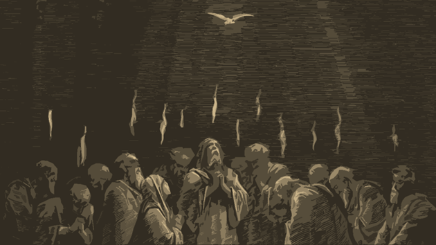

import RefreshOnFirstLoad from '@site/src/components/HomepageFeatures/RefreshOnFirstLoad';

<RefreshOnFirstLoad />

## **Introduction: The Origin**

  <audio controls>
    <source src="/audio/00_introduction.mp3" type="audio/mpeg" />
  </audio>

The Ancient Paths is the biblically based, God-ordained path to walk in repentance by disciplining ourselves in a true discipleship process that starts with developing spiritual discipline and approaching God in faith that he will transform us; thereby killing off the desire to continually walk in sin.

We recognize much of the universal church as forgotten how to teach and demonstrate this vital part of following Christ, exchanging the concept of revival in the heart of sinful man, to revivalism that presupposes a man-centered and man-orchestrated revival. Colonial pastors observed, understood, and preached about this phenomenon before the United States and Canada were sovereign nations. The rotten fruit of that philosophy is currently in full bloom in the church and is why the church has lost its voice towards its outreach with the Gospel.

We do not entertain psychology, or any other worldly idea. All answers come from Scripture, as accepted by the Reformers and Early Church to be the 66 books and letters that comprise the library of the Holy Bible. The exercises of the Ancient Paths can be pursued among the fellowship of believers or may be installed in local churches (which is the preferred method). More on that later.

Once the brother has completed Exercises 1-8, he informs the Ancient Paths leadership that he is ready for the Ancient Paths 40-Day Challenge. In the AP Discord, the brother is placed on the Destiny private channel, where he will walk for 40 days with other brothers in installing and conducting the spiritual disciplines from exercises 1-8. It is asynchronous, where there is no need for all the brothers to meet at a specific time—that would be far too unrealistic. Rather, they pray, share, and post emojis on the channel for accountability. If they need more accountability, they ask for it: from other brothers, AP leaders, or even in their own household and church.

After the initial Destiny has concluded, they are eligible to continue through ["Spiritual Disciplines for the Christian Life"](https://www.christianbook.com/spiritual-disciplines-christian-updated-anniversary-edition/donald-whitney/9781615216178/pd/216178?en=google&event=SHOP&kw=christian-living-0-20%7C216178&p=1179710&utm_source=google&p=1229913&dv=c&cb_src=google&cb_typ=shopping&cb_cmp=233748492&cb_adg=14306043372&cb_kyw=&utm_medium=shopping&snav=GMERCH&gad_source=1&gclid=CjwKCAiA5Ka9BhB5EiwA1ZVtvH_et1oPq8PwNR2hhfmJUC4KUGSWMI_DtujhJNfXfsdc8Ua7A4XeJBoCE9cQAvD_BwE) and a Bible Study of Ephesians. Why Ephesians? Because it perfectly summarizes Romans, and if you understand Romans, you understand the Bible.

The entire discipleship process is meant to bring you closer to Christ and a love for Scripture. If it fails to do so, then that requires a deeper conversation on the understanding of the Gospel. But it is indicative you are (**1**) unwilling to separate from the world and (**2**) sin is preferred over the Kingdom of God and Christ. It is what it is: and it should serve as a grave flashing red light on your life, requiring radical amputation over the structure of your life. Having a complete understanding of Romans 1 is most helpful.

Finally. For participating in this challenge: I salute you. Not many dare to venture the hard and narrow road leading to life, but that is the Ancient-Way—the path to peace and understanding. It is the path to Christ.

## **Exercise 1: The Ancient Paths**

  <audio controls>
    <source src="/audio/01_exercise1.mp3" type="audio/mpeg" />
  </audio>

>**_Thus says the LORD:_** 
>**_“Stand by the roads, and look,_** 
>**_and ask for the ancient paths,_** 
>**_where the good way is; and walk in it,_** 
>**_and find rest for your souls.”_** 
>**_But they said, ‘We will not walk in it.’_**
>
>**_– Jeremiah 6:16_**

When the young prophet Jeremiah was warning the Southern Kingdom of Judah to repent from their wickedness and return to God, judgment was coming. The ancient paths Jeremiah spoke of were ancient during his time (630 BC). The paths were known by _learned men_. Sadly, the men of Judah rejected the warning and chose not to walk in it. Eyes wide-open rebellion to God. That same choice is given today to men ensnared in sexual immorality.

In Jeremiah’s time, he was calling for men to repent and return to faith in God by the prescribed appropriate worship—which all pointed to Jesus Christ. It begs the question, **“How does a man get on the Ancient Paths today?”**

**Answer: The Gospel of Jesus Christ.**

But what happens when [only half of North American churches have a biblical worldview?](https://www.barna.com/research/only-half-of-protestant-pastors-have-a-biblical-worldview/) What then, is being preached in the pulpits? What does that do for the man caught in sexual sin? I cannot in good conscience encourage men to attempt walking the Ancient Paths, assuming they understand The Fact of Jesus Christ. So let’s get this right before we start by having a firm foundation.

Here is a clear presentation of The Gospel by pastor Jeff Duncan from the first sermon he did on Romans 1:1-7 entitled [“The Gospel of God”](https://www.youtube.com/watch?v=owSVFabJwcI&list=PLlB062-zAjAFPEpYvfpjmP2TStVmC54Dq&index=5). Out of all the tools I will present to you, this is the most important: a pastor that faithfully preaches God’s Word. It has often been said, if you understand Romans, you understand the Bible. All of the Reformers knew this, chief among them, Martin Luther.

Daily disciplines. Holy habits. Spiritual disciplines. Means of grace. All designed to commune with our God, to worship him, and to be transformed/sanctified by Him. Don’t get twisted by the last sentence: this doesn’t mean offering up prayers to God to take away lust and then waiting on God as if he is a waiter to accomplish it while we twiddle our thumbs. Or worse. Self-help means the devices and schemes apart from delving into the graces God has already given. Prayer and study are fundamental. Self-examination is being brutally honest when confronted by biblical truth.

That is the purpose of this community. We press on to what God has ordained to transform sinful men. We do not entertain any other philosophy that falls into Colossians 2:8. Sexually broken Roman Christians were rapidly transformed, all of them coming out of a culture steeped in extreme sexual immorality, over 500 years before the first university opened its doors. They were armed with pastors/teachers, Scripture and a living God.

With that in mind, there are four things to keep in mind on the Ancient Paths:

1. Your heart attitude towards Christ and his Scriptures will be the determining factor of whether or not you are victorious over lust. This is above all other factors, strategies, tools, or techniques. If you are failing, press in on this point.
2. The Ancient Paths should develop holy structure and replaces unholy structure (or lack of any structure) in your life.
3. Guard against partaking in religious exercise for the sole purpose of getting rid of sexual immorality. Fighting sin is holy, yes. But if your heart attitude is rooted in wanting to get on with life after ditching your lack of sexual control and its consequences, then you missed point 1: **The proper worship of God made possible by Christ, as revealed through Scripture.** Christ has zero interest remaining as an adjunct part of your life. He has to be the center. The majority of Christian counselors and para-church ministries, almost exclusively focus on dealing with sexual sin (the presenting problem), while ignoring the root problem: _the heart attitude towards Christ and Scripture_ (point 1). Brothers express anger and frustration because lust doesn’t immediately go away. Remember, you are on an Ancient Path to worship God because of revelation to you. Do your work while he does his.
4. We must become masters at fleeing sexual immorality.
   :::note Did you know

   **Sexual immorality is the only sin in which we are commanded to flee from?** 1 Cor 6:18 is a great memory verse, sure; but it also establishes we must perfect the art of fleeing. Press in on it. Fleeing takes on many forms: what does it mean to you?

   :::
5. [Antinomianism](https://www.gotquestions.org/antinomianism.html) in the church is largely responsible for how many of us got here, so guard against it. Don’t know what that means? I have some tools for you.

To prepare you for this journey, Exercise 1 introduces tools. They are good tools, but not the only tools. I gathered these tools from learned men—and you certainly may have some of your own.

[Blue Letter Bible](https://www.blueletterbible.org/) offers much more than just the Bible. It’s free, you can pick your translation preference (even language), it has Bible Reading plans, commentaries, devotions, free Christian Education courses, catechisms, and much more.

What is a [catechism](https://www.thegospelcoalition.org/article/should-know-catechisms/)? Think of it as Sunday School, well before computers and electricity. It summarizes what the Bible teaches. I posted two well-known catechisms: [Westminster Catechism](https://thewestminsterstandard.org/westminster-larger-catechism/) and [C.H. Spurgeon’s Catechism](https://www.blueletterbible.org/study/ccc/chs_PuritanCatechism.cfm). Check out question 1 of each. _Learned men thought Question 1 was pretty important._ Then examine them so that you learn what they can do for you on this journey.

:::note Did you know

It was a common practice for Christians coming out of the Reformation to memorize catechism questions and answers. Why? Because Christian education died under Catholicism after the 4th Century.

:::

Latin Mass (which common people didn’t speak), rituals, relics, and indulgences took their place. **People were not reading the Bible**, and in many cases, it was illegal to do so or even own a Bible.

- [Gotquestions.org](http://gotquestions.org/) is a really good source for general research on Bible questions. Want to know what the Bible says about depression? Sexual immorality? Marriage? Doctrine of justification (salvation)? Sanctification? Glorification? Antinomianism?
- [Sonic Light](https://soniclight.com/) This is a solid Bible commentary by Dr Tom Constable. Ever get lost in what you are reading? His method presents popular interpretations by scholars, then he weighs in on what is the most reasonable viewpoint. It’s a great resource and many of the books of the Bible have a companion Spanish version.
- [Practical Tips for Scripture Memorization](https://www.youtube.com/watch?v=ugSMI1KEs5A) John Piper discusses Andy Davis’s resource. This is a separate exercise by itself because it is vitally important. _Did you know it was common to find many early church Christians having memorized most of the New Testament?_
- [Impact Video Ministries](https://www.youtube.com/@ImpactVideoMinistries/playlists) I recently discovered this resource. Amazing how so many topics he did applies to what men dealing with sexual issues. Straight forward.
- [How to Study the Bible and Journaling](https://www.tvcresources.net/wp-content/uploads/2020/02/201006260900FMWC22ATAAA_MattChandlerJoshPatterson_SaturdaySeminar-HowToStudyTheBible.mp3) A literal Master Class by Matt Chandler. This is where many men trapped in lust have problems with. This is a separate exercise by itself as it is vitally important. For exercise 1, you do not need to listen to this teaching, just know it’s coming.

The following are the cheapest and best resources I have found for their respective topics. Each one is a separate exercise in this guidebook, and some can be acquired free:

- [“Godliness Through Discipline”](https://www.christianbook.com/godliness-through-discipline-jay-adams/9780875520216/pd/5520219?event=BRSRCG|PSEN) by Dr. Jay E Adams is going to address one specific area because so many men fail at putting sexual sin to death: they simply were never trained to have the discipline to fight. This must be rectified first. Christ doesn’t want “vulnerable” men in his service. He wants steadfast men who are warriors. That doesn’t happen without discipline.
- ["What is Repentance?](https://www.christianbook.com/what-is-repentance-r-c-sproul/9781642890532/pd/890532?event=BRSRCG|PSEN) by RC Sproul, will settle the issue on a poorly taught subject in churches today. He will define it, show the picture, model, and regeneration of repentance. For $3.00 and 37 pages, you will understand what it means, and you will use it to guide you in this battle.
- [“Praying the Bible”](https://www.christianbook.com/praying-the-bible-donald-whitney/9781433547843/pd/547843?event=BRSRCG|PSEN) by Donald Whitney, will restructure your prayer life like you never thought possible. It is a game-changer. I get more comments from brothers about this book than any other resource. Is $10.00 worth it to you to have a vibrant transformative prayer life? If you can’t afford it, I’ll buy it for you. Yeah, it’s that good.
- [“The Mortification of Sin”](https://www.christianbook.com/the-mortification-of-sin/john-owen/9781800402683/pd/0402683?event=BRSRCG|PSEN) by John Owen, gets down to the nitty-gritty and reveals what most sin-soaked men missed in their Christian education, largely because the churches fail to teach. This is a classic, and being discipled by a pastor from the year 1536 is worth the price of admission. You can get this book for [FREE](https://librivox.org/the-mortification-of-sin-in-believers-by-john-owen/) in audio format online, but I highly recommend purchasing a hard cover copy as you will keep referring to it.

**SELF-EXAMINATION:**

- Do I understand the Gospel?
- Question 1 on both Catechisms: Describe how lust prevents your chief purpose from being realized.
- What is the truth about your Bible reading and prayer time as you read this? Describe each in one sentence. Write it in your journal and watch what God does.
- How can your Guardian keep you accountable on this path?
- What does fleeing sexual immorality look like from a practical day-to-day standpoint?

## **Exercise 2: Godliness Through Discipline**

  <audio controls>
    <source src="/audio/02_exercise2.mp3" type="audio/mpeg" />
  </audio>

As soon as I read the pamphlet “[Godliness Through Discipline”](https://www.christianbook.com/godliness-through-discipline-jay-adams/9780875520216/pd/5520219?event=BRSRCG|PSEN) from the father of the modern biblical counseling movement, Dr. Jay E Adams, I knew I had to include this early in the Ancient Paths curriculum. Why? Because it addresses an issue so many men face: the elusiveness of change and their frustration when it seems no change is happening.

If I had to summarize the 25 pages of Adam’s pamphlet, it would be this: **_Men don’t experience change because they have never been trained in discipline._** So they give up when they don’t see immediate results. Consequently, holy habits are not formed in the man’s life and the Holy Spirit has nothing to work with. Man doesn’t do his part, so God can’t do his. **Transformation doesn’t happen.**

Adams makes the point that real change happens by forming new habits to replace the old. In fact, the ability of man to form habits is an amazing gift from God in the process of transformation, and eventual sanctification. The obstacle, however, is the state of the church that has failed to adequately train men and insist on discipline in the practice of the faith: _so that the Holy Spirit can do his work in purifying the church that Christ died for._

Ouch.

Let’s focus on the sexually immoral (because the pamphlet doesn’t specifically address it). Sexually immoral man didn’t become ensnared overnight. It required effort over a period of time to formulate the habit of rebellion against God to satisfy a deceitful desire. By the time a man realizes he has been ensnared by his constant seeking for satisfaction in a sin, the hook has been set. Physiologically, the brain insists on the dopamine it has become so accustomed to from its release into the neural pathways. _Spiritually, it is compounded by the hardening of the heart towards God._

When a man encounters Jesus Christ, he becomes a new creature in his orientation towards God by the Holy Spirit to **_desire holiness_**: But he can’t get there because there is no discipline. In fact, sexual immorality cuts off spiritual growth and the man becomes even more undisciplined. This results in negative effects in many other areas of a man’s life. Sound familiar? Instead of a vibrant spiritual life, the man drifts in a shallow relationship with God, hoping something would change, but it never happens. The rotten fruit in the man’s life, as well as the church as a whole, is self-evident: **the men withdraw into isolation and half of the churches fail to have a biblical worldview** (as we learned in Exercise #1).

**SELF-EXAMINATION:**

What do we make of all this on the Ancient Paths that God calls us to?

- This journey to pursue the Life of God requires discipline
- The spiritual disciplines are prescribed by God to bring forth transformation and holiness
- We walk by faith, by the grace of God
- We add accountability in all facets
- When we fall, we get back up
- We don’t quit

_“But they said, we will not walk in it”_ (the Ancient Paths).

Now it’s your turn to respond. Will you fight, or go quietly in the night?

:::note Note

Sexual sin was endemic when the kingdom of Judah refused. Most of the United States and Canada is refusing; indeed, most of the world.

:::

## **Exercise 3: Repentance Verses Recovery**

  <audio controls>
    <source src="/audio/03_exercise3.mp3" type="audio/mpeg" />
  </audio>

There is a lot of shallow teaching on repentance. Many churches focus their entire ministry on the doctrine of justification (salvation) and little on the doctrine of sanctification/transformation. Ironically, _sanctification should be where the believer should focus the remainder of his time on earth after coming to Christ._ Justification is a one-time event. Sanctification is the rest of your life prior to the final progression of salvation, which is glorification.

So what do we do about the term, "recovery?" I have two problems with this term, as fashionable as it is in all addiction circles.

1. In his famous sermon series ["The Consequence of Ideas"](https://youtube.com/playlist?list=PL_wopcEyf7iz2m8Z-SnggSrC4MTZ7NAY_&si=UuBcSwOLHPWXBbXD), RC Sproul traces the development of Western Civilization and its philosophies back to ideas. His premise is: **Right thinking brings forth right actions.** Wrong thinking brings about catastrophe. Such is the case with "recovery" in the context of sexual sin.
2. As a consequence (of bad thinking), it has supplanted repentance in usage, and that has had devastating effects:
    1. It fosters a lack of contrition towards the God who is to be feared (Ecclesiastes 12:13)
    2. It results in _anti-intellectualism_ because "recovery" _softens the need for men to fully and intensively examine the path back to God._
    3. It ultimately allows stagnation in sin. As one brother put it when he compared the Ancient Paths with everything else being offered, "men become content walking in sin in perpetuity."

I have a disdain for the use of "recovery" in our circles. "Vulnerability" is another term that makes me want to start throwing furniture; perhaps I'll get to that later in another exercise. It replaced "humility," which is the first step towards repentance (2 Chron 7:14). The introduction of both terms, _borrowed from psychology_ (Col 2:8) have made millions for charlatans, while stumping spiritual growth for untold numbers of men.

Let's understand what repentance is. Please acquire the cheap, 37-page booklet, ["What is Repentance?"](https://www.christianbook.com/what-is-repentance-r-c-sproul/9781642890532/pd/890532?srsltid=AfmBOooGsWNQTe-lFu0BLNyEpZIMocRh5RhOX9zuSw6DGaK3dHWD0iqo) by RC [Sproul.](https://www.amazon.com/What-Repentance-Crucial-Questions-Sproul/dp/1642890537?asin=1642890537&revisionId=&format=4&depth=1) Judge for yourself if "recovery" has a place in the Ancient Paths. In addition to [RC Sproul](https://www.youtube.com/playlist?list=PL30acyfm60fU98vgZA8VdhBLzVSn9cdfT), I also recommend anything [Tim Conway](https://youtube.com/playlist?list=PLpti0Kuyu_o9jbCq_LXm8QcnOVuGDcozu&si=1fGlcvDjLsUZ0u5B) or [Paul Washer](https://www.youtube.com/playlist?list=PLmo8sihYO3ZDOzzY8zCcByRdpAPYalL_Y) does on the subject, because they specifically address sexual sin. Brutally honest, practical, and encouraging. But if you need a lot of encouragement, seek out [John Piper](https://www.youtube.com/playlist?list=PLAcB0f-21Xj293wuhNDwHZ-LEi50pzmMa): his spiritual gift of exhortation is wonderful, particularly when shame and failure dominate a man.

[How Do I Repent – Tim Conway](https://www.youtube.com/watch?v=7vU0TTQTvLw)

**TALK WITH YOUR GUARDIAN:**

- What was your initial thinking of repentance? Was it shallow by thinking it equates to being sorrowful?
- What part of these resources on repentance impacted you the most?
- What is your next step, and how will accountability be built in?

:::note Definition

**Guardian**: A _Guardian_ is a brother who has walked the Ancient Paths and is faithful to helping others on the path to sexual purity in Christ. For more information, see the Appendix or reach out to an Admin.

:::

## **Exercise 4: Get In The Word**

  <audio controls>
    <source src="/audio/04_exercise4.mp3" type="audio/mpeg" />
  </audio>

Exercise #1 gave us an introduction to the Ancient Paths. Exercises #2 and #3 gave us a foundation on two of the main issues in which men get wrong from the start in the sanctification process. Exercise #4 provides us with the first spiritual discipline that will be the foundational for the rest of your life.

View the short video [Get in the Word Today—Tim Conway](file:///C:\Users\jason\Downloads\ancientpaths.io\docs\Get%20in%20the%20Word%20Today—Tim%20Conway) (8 min 30 sec) Listen to [“Aim at Glory”](https://www.gracechurchcc.com/aiming-at-glory/) a sermon by Jeff Duncan (1 Corinthians 10:31) (Skip to the 23:00 minute mark, it is available on audio and video.)

Consistent time in the Word is foundational if you truly hope to defeat lust. Here is the sermon outline to follow along:

Main Point: Aim at God’s glory by joyfully keeping God’s Word in the power of the Spirit with patient persistence.

1. Aim at God’s glory by obeying God’s Word (1 Cor 10:31)
    - - Piety: **obedience to God’s Word out of joy**
        - Repenting of sin and turning to holiness
        - Keeping His Word means knowing it—to know it means you must read it, meditate on it, talk about it (Col 3:16)
2. Aim at glory by depending on God’s Spirit (Eph 1:13)
    - - God gets the glory when his power transforms.
3. Aim at glory waiting for perfection (1 Pe 4:10-11)
    - Put off the old man, put on the new (Eph 5)
    - Stop expecting perfection
    - Sanctification: **He will accomplish it, not you** (2 Pe 3:17-18); Acts 17 commands patience

Applications: Put these disciplines into practice and develop a daily rhythm to aid in your sanctification and renewal.

- - Aim at glory by aiming at God’s Word
    - Memorizing Scripture, meditating, feeding off Christ **daily**

(Psalm 1:2-3, John 4:31)

- - Make every effort to add to your faith (1 Pe 1:5)
    - Aim at God’s glory by _depending on His Spirit_
    - Make use of the means he has given us; **the same power that resurrected Christ**
    - Aim at glory waiting for perfection
    - Confess failure, keep aiming

Select a Bible Reading Plan. These plans are suggestions. It isn’t hard to find a plan using a basic search of the internet. Your church may have a plan for the entire congregation. The point is: have a plan. My personal recommendation for a man that is not accustomed to having a plan, is the [“Walking with Jesus”](https://gracechurchcc.com/walking-with-jesus/) reading plan. Why? A man battling sexual sin needs to be _confronted directly_ by Jesus Christ. In one year, the reader will go through the Gospels twice and will largely stay in the New Testament.

There are many plans out there. As I mentioned in Exercise #1, the Blue Letter Bible has reading plans. Here are some others:

- [Through the Bible in a Year](https://www.esv.org/plans/daily-reading-bible/) (ESV.org)
- [Basic Bible Overview Plan](https://www.gracechurchcc.com/basic-overview-of-the-bible-reading-plan/) (Grace Church CC)
- [Walking with Jesus Plan](https://www.gracechurchcc.com/walking-with-jesus/) (Grace Church CC)
- [Bible Reading Plans](https://www.ligonier.org/posts/bible-reading-plans) (Ligonier Ministries)

**SELF-EXAMINATION:**

- Will you continue this year to seek your own glory by fighting lust by your own plans and schemes, or will God get the glory by feeding off His Word and changing you from the inside out?

## **Exercise 5: Bible Study/Journaling**

  <audio controls>
    <source src="/audio/05_exercise5.mp3" type="audio/mpeg" />
  </audio>

Now we put on the big-boy pants. I hope you notice a trend in all the exercises in Ancient Paths. Namely, STRUCTURE. Holy structure. The sexually immoral live the antithesis of structure in their life: **_it’s selfish, chaotic, unstructured, and rebellious living_**. It fractures structured areas of our life. Anyone lose a marriage? Relationships? Employment? Ministry opportunities? Is it possible that true repentance and healing comes from Jesus’ _remaking_ (sanctifying) you with biblical structure, found in the spiritual disciplines he designed?

I say yes. The Bible is structure. Repentance is structure. Prayer. Devotions. Self-Examination. Poke your head out the window and see creation. What do you see? Structure and power. Our God is a stabilizing force that uses structure. Recall the story, and you will see systematic restructuring of nothing into beauty.

With that in mind, I give you the Master Class on Journaling and Bible study by Matt Chandler. The audio version (which I prefer) can be found here: “[How to Study the Bible”](https://www.tvcresources.net/wp-content/uploads/2020/02/201006260900FMWC22ATAAA_MattChandlerJoshPatterson_SaturdaySeminar-HowToStudyTheBible.mp3). You will want to take notes and put this in your journal. No, really. Take notes because you will be referring back to them. The audio version runs for about 54 minutes—you do not have to listen to the 2nd speaker.

**TALK WITH YOUR GUARDIAN:**

- What is the time/place for the activity of Bible Study and journaling?
- How are you going to _fence this time off_ from all distractions?
- How will you build in accountability so that this “task” leads to permanent structure in your life as you commune with the Lord?

## **Exercise 6: Prayer**

  <audio controls>
    <source src="/audio/06_exercise6.mp3" type="audio/mpeg" />
  </audio>

This exercise is meant to restructure your prayer life so that it is vibrant and allows the Lord to guide your thoughts by using Scripture. "Praying the Bible" is the single-most commented on resource from other brothers on the Ancient Paths. Why? Because they never had a prayer life so good, and the effects were remarkable.

These short videos combine great theology and application:

- [If You Don't Pray, You Won't Live - John Piper](https://www.youtube.com/watch?v=QJ9sfxMv3qE&t=7s) (12mins 21 secs)
- [A Theology of Prayer in 3 Minutes - John Piper](https://www.youtube.com/watch?v=OssBHX5rSiE) (3mins 52 secs)
- [Teach us to Pray - John Piper](https://www.youtube.com/watch?v=V-_lmGR9EdE&t=14s) (4min 12 secs)

[Praying the Bible - Donald Witney](https://www.christianbook.com/praying-the-bible-donald-whitney/9781433547843/pd/547843?event=ESRCG) 
[Psalms: The Prayer Book of the Bible - Dietrich Bonhoeffer](https://www.christianbook.com/psalms-the-prayer-book-the-bible/9781506480190/pd/480192?srsltid=AfmBOooQOgkORZJyBGyUKVuT7hR_zJeUEZFkjvF8OimT5G0uMOUZff_r)

**TALK WITH YOUR GUARDIAN:**

- After you get the hang of the technique, compare your evolving new prayer life to what existed before.

## **Exercise 7: Scripture Memorization**

  <audio controls>
    <source src="/audio/07_exercise7.mp3" type="audio/mpeg" />
  </audio>

>**_“I have stored up your word in my heart, that I might not sin against you.”_** 
>**_– Psalm 119:11_**

Let’s face it gentlemen, _we have a problem with our thought life_. We are prone to go into fantasy land, and into sin. What’s needed?

A divine tool that replaces dark patterns. Scripture Memorization causes the “Word of Christ to dwell in you richly” (Col 3:16). This is a means of grace God has given to us, his children, throughout all recorded history to rely on His power.

In fact, if you memorized just the verses dealing with sexual immorality in Ephesians 4 & 5, 1 Cor 6 and Romans 1, you would have a great theological understanding of what happened to all of us throughout the course of our lives, from God’s viewpoint. Then, corrective action can be taken; one action is Scripture memorization.

Please understand two major points concerning this discipline:

- 1. God needs to **pressure wash** your soul from all the garbage you invited in, and ingested. I say “pressure wash” because it is objectively understood by everyone in the physical world, that some states of dirtiness or so thoroughly deep, that a regular garden hose and dish detergent isn’t going to get the job done. That garbage isn’t limited to pornographic images. **Bad theology. Worldly wisdom. Outright rebellion.** Horrendous sermons that you preached to your soul, like “I am worthless,” or “I am beyond God’s love,” or “The Bible doesn’t have all the answers I need.” or “I tried praying and reading the Bible and it hasn’t worked.” All these issues require pressure washing multiple times. Not coincidentally, God has chosen to “wash” his people and transform/sanctify them by his Word.
- “Wash”, “washed”, and “washing” in the New Testament: 1 Cor 6:11; Heb 10:22; Eph 5:26; Tit 3:5
- “Transform” and “transformed” in the New Testament: Rom 12:2; 2 Cor 3:18
- “Sanctify” and “sanctifying” in the New Testament: John 17:17; Eph 5:26 (again); John 17:19; Acts 20:32; Heb 10:14

How do we summarize this? God uses his Word to wash his people, transforming their minds in the process of sanctification, which the Holy Spirit performs unto final sanctification. It happens on the inside, resulting in outward fruit, observable by others (Matt 7:20). Now, do you see how important Scripture memorization is?

1. Every false thought or proposition must be confronted with truth (2 Cor 10:4-5). How do we do that? Scripture memorization. The only offensive weapon a Christian has is the Sword of the Spirit (Eph 6:17), which is the Word of God. **When temptation comes**... you cannot be fumbling with trying to recall Scripture. It must be ingrained into you, and it must strike at the heart of evil. Gentlemen, I propose to you that there is NO OTHER discipline aside from Scripture memorization that can accomplish this.

You don’t know what you are missing until you memorize a letter or book of the Bible. You get the entire context, it forces you to study, and something else happens: _you get stronger_. When you go back to pornography, you will at first struggle thinking your time will be more fulfilling memorizing. But one day, you will win. Then the next battle. Then the next battle. Then the next battle, and so on.

Here are some short videos to help you think about this topic:

- [There is no Substitute for Memorizing Scripture - John Piper](https://www.youtube.com/watch?v=nMKJTA6kTkc) (5mins 25secs)
- [5 Easy Tips to Memorize Scripture - Denise Trio](https://www.youtube.com/watch?v=NJuGw8Cb-n0&list=PLh9C0bgEBAtyIgLByQS14aMZsPlRl0sA4&index=2) (7mins 17secs)

:::note Note

The 5th technique is what many Bible colleges teach to freshman students. The [Bible Memory App](https://biblememory.com/) also has this option.

:::

- [Why I Memorize Books of the Bible - Andrew Davis](https://www.desiringgod.org/articles/why-i-memorize-books-of-the-bible)

I still use spiraled 3x5 index cards, but consider the functionality, portability, and ease of the [Bible Memory App](https://biblememory.com/). The flashcard function aids your learning by requiring the first letter of a word, thus saving time from typing while facilitating memorization.

**TALK WITH YOUR GUARDIAN:**

- What verses should I memorize first?
- Build in accountability; be realistic (2-3 passages/week, or 1 chapter/month)
- Journal how your thought life improves when memorizing Scripture.
- Journal how much your TV time diminishes.

:::note Bonus

Journal WHEN (not if) you make a conscious decision to review verses rather than seek porn. It’s going to happen if you stay on this path.

:::

## **Exercise 8: Fasting**

  <audio controls>
    <source src="/audio/08_exercise8.mp3" type="audio/mpeg" />
  </audio>

>**_“Is not this the fast that I choose:_**
>**_to loose the bonds of wickedness,_**
>**_to undo the straps of the yok_**
>**_to let the oppressed go free,_**
>**_and to break every yoke?”_** 
>**_– Isaiah 58:6_**

Loose the bonds of wickedness, undo, go free, and break every yoke... in the entire conversation of recovery/killing lust, do you think we might be missing something that is prescribed by God?

In his book, [“The Spiritual Disciplines” Donald Witney](https://www.christianbook.com/spiritual-disciplines-christian-updated-anniversary-edition/donald-whitney/9781615216178/pd/216178?event=BRSRCG|PSEN) (yes, the same author of “Praying the Bible” from Exercise #4), devotes an entire chapter on fasting (chapter 9), and it is a great resource if you want to know the whole scope of biblical fasting. I highly recommend this book as it also covers each of the spiritual disciplines mentioned in Ancient Paths... and much more.

But suffice to say, Western culture has slaughtered this important and altogether necessary spiritual discipline. We live in a culture of excess, catering to our every need. The concept of willingly suffering discomfort is largely foreign, except for gym rats who want a better body to display to society. Not all, of course, but a great many. _Vanity wins in today’s society_.

So far removed from our churches, fasting is rarely preached on or practiced among the congregations. But why? Because **Jesus expects his followers to fast**. Let that sink in. It is not “if” a believer should fast, _it is when, and for how long_. Look at every statement Jesus makes concerning fasting: “When you fast...” Not “if”. Fasting is mentioned more than baptism. And we don’t talk about it, but we certainly whine when nothing changes.

Ouch. That hit me hard, too.

So, let’s cut to the chase: _We lust-filled men must fast_. From what? Food. Really, food? Yes, as well as porn/coffee/games/entertainment (insert the idol, distraction, or temptation). Absent that, I don’t see any reasonable expectation a man has in overcoming and defeating lust. Why do I say that? Because sexual immorality has a grip on our hearts, and it is out of the heart that such evil comes from (Matt 15:19). The grip must be broken.

The Roman Christians normally fasted twice a week (see [Didache](https://www.ccel.org/ccel/richardson/fathers.viii.i.iii.html)), and they certainly didn’t live sedentary lives. They burned calories and did quite well in coming out of a culture of sin-soaked sexual immorality. **Every sexual pleasure for men was expected** _(there was a double standard with women)_ **which is why Christianity boldly collided with Roman culture**. Christians were hated because sexual purity was demanded.

Pointers on fasting:

- Biblically, it almost always deals with the abstinence of food, but a thorough reading of Isaiah 58:6-12 broadens the scope; most pastors would agree that _abstaining from certain things that make you particularly uncomfortable (suffering loss) to pursue the glory of God, is worthy of consideration_
- It always has a spiritual purpose
- **It is regular and normal for Christians to fast**
- _It confirms God is real to us as we pursue him_
- The length varies; even missing a meal is considered a fast
- Those who cannot fast due to medical purposes can fast by reducing portions, or limit themselves to certain foods, like vegetables
- Fasting is guided by the Holy Spirit in terms of length and detail
- It is not for boasting- fast in secrecy; spouses excepted, of course
- _The hunger pains remind you of your purpose of fasting: that is when you pray_
- Fasting pairs well with Scripture memorization (Matt 4:4)
- Fasting is hungering for the Bridegroom to return (Jesus Christ); representative of our hunger for him, when all will be fulfilled
- Although there are massive health benefits to fasting, none are mentioned in the Bible—and it should not be the purpose; nor even be in competition with the spiritual purpose; it there is any physical benefit to be gained, chalk it up to an added grace from God, _but don’t be distracted from the real purpose_

[Why Do Christians Fast? - John Piper](https://www.youtube.com/watch?v=KTJb4DsFPQg) (12mins 50secs) 
[A Hunger for God Through Prayer and Fasting - John Piper](https://www.youtube.com/watch?v=arQnr37lAQg) (3mins 6secs)

**TALK WITH YOUR GUARDIAN:**

- To date, what has my attitude been concerning fasting?
- How will I add fasting to my worship to demonstrate dependence on God to loose the bands of wickedness?

## **Exercise 9: Memorize A Good Hymn**

  <audio controls>
    <source src="/audio/09_exercise9.mp3" type="audio/mpeg" />
  </audio>

This is one of my favorites, and those that know my story can understand why. Brothers, when facing temptation or experiencing the “dip” in faith that precedes a choice to obey Christ or give into lust: _A theologically rich hymn cuts through temptation like a hot knife through butter._ There is biblical precedent in this part of spiritual warfare, and in the life of God in the broader sense. It’s as ancient as the ancient paths we seek to walk in.

- [Ambush Satan With a Song - John Piper](https://www.youtube.com/watch?v=Yrw5roZDWqY) (3mins 36secs)
- [Ambush Satan With a Song - John Piper](https://www.desiringgod.org/messages/ambushing-satan-with-song) (full message 2 Chronicles 20:1-25; 30 mins)

**TALK WITH YOUR GUARDIAN:**

What separated Cain from Abel in Genesis 4? Fundamentally, a heart for worshiping God. Neither of the brothers had an issue believing in the existence of God; after all, their whole family had a walking, talking relationship with God. Their mom and dad knew everything that transpired from the beginning.

- What do you think will separate all of humanity throughout history?
- How does singing to the Lord fit into the Ancient Paths (Jeremiah 6:16)?
- Do you think a lack of desire to sing to the Lord might be an obstacle to victory over lust?
- What do you find when doing a word search of “sing” and “song” and “hymns” throughout the Bible?

[Theologically Rich Christian Music Playlist](https://www.youtube.com/watch?v=sk7qj4OGX1k)

:::note Bonus

Write a song to the Lord using Scripture and your imagination. David did it and we still read about them today (Psalms).

:::

## **Exercise 10: Help! My Marriage is in Jeopardy**

  <audio controls>
    <source src="/audio/10_exercise10.mp3" type="audio/mpeg" />
  </audio>

This is a recurring topic I’m sure many have faced. It is one of the toughest topics due to the trajectory of marriage in the U.S. and abroad. There are two forces at work here:

1. A misunderstanding of what Biblical marriage is supposed to look like (most people jump into marriage sideways, or come out of divorced homes without full understanding of what marriage is in God’s eyes) 
2. A culture that does nothing to strengthen marriage (in fact, it does its level best to tear marriages apart). Both create misguided expectations that make divorce so popular, even in the church.

John Piper has several videos addressing this (see below), including wisdom imparted by learned men along the way:

- Jesus restores—men, women, and marriages
- The book of Hosea is a marvelous picture of God’s willingness to forgive and offer restoration after serious infidelity
- You must communicate your intention to point your feet towards Christ, walk in repentance, and restructure your life and marriage in pursuit of God
- Past failures are to remain in the past; if previous pastors failed in teaching how to accomplish this—give glory to God for his abundant grace, because now you are learning
- Your wife needs to see commitment rather than hearing you talk about it (that includes the spiritual disciplines mentioned in these exercises)
- Your wife needs to see transformation (you cannot remain the same person—and that only comes from God through the spiritual disciplines)
- You must accept you cannot force your wife to remain in the marriage: nonetheless, that should have zero bearing on your seriousness to abandon a shallow relationship with Christ, and press in on cultivating a love for Christ
- If journaling scares you because of privacy issues, have a straight-forward conversation with your wife and establish boundaries allowing you to work through your sin with God, in private
- Having your wife as an ally monitoring your internet/cell usage is generally a bad idea; more accountability with other men is usually a better option because you need to develop walking in the light by encouragement from other men—not breaking your wife’s heart and discouraging her, even though you are on the right path

I hope these videos from John Piper help orient you and your wife towards a life-long pursuit of Christ:

- [Is My Husband’s Porn a Marriage Deal-Breaker?](https://www.youtube.com/watch?v=6r8d499kGUs) (7mins 40 secs)
- [To a Spouse Considering Divorce](https://www.youtube.com/watch?v=op8rkoEdigo) (8min 55secs)
- [Does the Bible Allow for Divorce in the Case of Adultery?](https://www.youtube.com/watch?v=h5CtfT-MqgA) (5min 46secs)
- [What Should a Couple Do After a Spouse Has Cheated?](https://www.youtube.com/watch?v=EL2qrLr9N4w) (3min 5secs)
- [How Can I Heal my Marriage After Adultery?](https://www.youtube.com/watch?v=6RHIVkK3ISo) (4min 26secs)
- [What Every Marriage Needs the Most](https://www.youtube.com/watch?v=Xq_GILttlDE) (9min 46secs)

**TALK WITH YOUR GUARDIAN:**

- What things must be re-ordered, added, or cut from my life to show my wife my new approach is serious about restoring my marriage to biblical standards?
- How will I build accountability to ensure this path isn’t only aspirational, but becomes objectively real?

## **Exercise 11: The 800lb Gorilla In The Room**

  <audio controls>
    <source src="/audio/11_exercise11.mp3" type="audio/mpeg" />
  </audio>

If we are being honest, you knew this was coming. At some point it needed to be addressed. It’s the topic everyone dances around. It makes people uncomfortable and many automatically throw up a straw-man argument using cherry-picked verses that trumps all other doctrines with no attempt to harmonize. It’s the most terrifying passages in Scripture for the sexually immoral, and we pretend it’s not there like the proverbial 800lb gorilla in the room:

**[_Ephesians 5:3-7_](https://biblehub.com/esv/ephesians/5.htm)** 
**[_Hebrews 10:26-31_](https://biblehub.com/esv/hebrews/10.htm)**

It isn’t profitable to whistle past the graveyard, nor to exhort anyone on the Ancient Paths, while skipping an issue the church avoids. Antinomianism is a poison many of us drank from. There’s that word again. It is imperative to understand what it means, along with its ugly sister, legalism. The church has largely ignored its peril. In Exercise # 1, tools were introduced to help you study. Also, Sinclair Ferguson dealt with both legalism and antinomianism in his excellent book, [“The Whole Christ”](https://store.ligonier.org/the-whole-christ-legalism-antinomianism-gospel-assurance-hardcover).

What do legalism and antinomianism have to do with the above passages? **Both theological camps short-circuit repentance**, and by doing so, causes a poor understanding of the Gospel and how to harmonize the doctrines of Justification and Sanctification. Here is how both are deathly poisonous:

- A legalistic theology will insist on lists of “Dos” and “Don’ts” that gives the adherent a false sense of assurance of their salvation, based on their own works.
- An antinomian theology cherry-picks verses to construct a theology built on Justification alone, dismissing the need for sanctification as evidence of salvation.

How is this deadly for the sexually immoral? Because sexual immorality is a powerful hook in the heart that is inescapable without a true disciplined approach to working out repentance, and if a sexually immoral person is feeding off of either legalism or antinomianism, it destroys true repentance because the person thinks he is “OK” and in right standing with God, out of their cherry-picked verses used to construct a theology that is at odds with the whole counsel of God.

Brothers, I mentioned in Exercise #1 that one of the most important factors in defeating this sin is sitting under good preaching. Being taught correctly. If you do not know what that means, you need to find out. Mark Devers wrote a book entitled, [“Nine Marks of a Healthy Church”](https://www.christianbook.com/nine-marks-healthy-church-revised-edition/mark-dever/9781433578113/pd/578113?event=BRSRCG|PSEN). You can conduct a search and discover what they are, without buying the book.

For this exercise, I’d like to focus on Ephesians 5:3-7. John Piper will walk you through the passage in a series of 6 short videos. Wherever you stand on this passage, be careful to consider (**1**) the [_hermeneutics_](https://www.gotquestions.org/Biblical-hermeneutics.html) used (method of biblical interpretation): this is a pastoral letter to Christians, and the text is plain. (**2**) comparing with and harmonizing with other Scripture (Hebrews 10:26-31) and (**3**) the grace of God.

What do I mean by “grace of God” in this sense? Consider the following:

- There should be countless men in Ancient Paths. They are not here. **But you are.** God by his grace led you here.
- There are many in recovery, chasing worldly philosophies (Col 2:8) that are unbiblical, straying from the Path (that leads to godliness and freedom), even calling into question the _sufficiency of Scripture_. They are not in the Ancient Paths. **But you are.**
- This is the sternest warning in the New Testament regarding sexual immorality. As I noted, it is a pastoral letter to professing Christians, and you are about to get a Master Class on this passage from one of the most esteemed pastors in the North American church. Not many will receive this message, nor will they be able to _harmonize the doctrines of justification, sanctification, and glorification_ (the three progressions of salvation). **But you will.**

After studying the doctrines of Justification and Sanctification, using the tools in Exercise 1 (they are in the catechisms for you to review), and sitting under good preaching, I was instructed in what I was missing: an understanding of sanctification, and what that means to the sexually immoral. **If there is progressive sanctification in your life**, then that is the work of the Spirit (2 Corinthians 3:18). That is great news. Keep going!

To the brother with no evidence of progressive sanctification: Praise God from whom all blessings flow—because instead of spinning your wheels, you are now on an ancient path leading to restoration. Go back and review Exercise 1 and every other exercise that isn’t well-rooted in your life. Add more accountability when something isn’t taking root.

:::note Know This

God sifts all of humanity. He brought you to a place to hear a tough message that most avoid... rejoice! Then press in on it.

:::

*Here are 6 short videos from John Piper on Ephesians 5:3-7:*

- [Part 1 Should Saints Be Warned About Wrath?](https://www.youtube.com/watch?v=kpx_6tC1kec) (12mins 5sec)
- [Part 2 How is Covetousness the Root of Sexual Idolatry?](https://www.youtube.com/watch?v=5SPf7BZmNz4) (10min)
- [Part 3 Sexual Immorality is not Even to be Named](https://www.youtube.com/watch?v=45pf7lsCvL8&t=1s) (10min 54sec)
- [Part 4 How is Something not Proper for Saints?](https://www.youtube.com/watch?v=4xT_v8BISPU) (12min 43sec)
- [Part 5 How Does Thankfulness Clean up the Mouth?](https://www.youtube.com/watch?v=EAiMfi5DjKs) (12min 18sec)
- [Part 6 How to Escape the Coming Wrath of God](https://www.youtube.com/watch?v=3JATpy4oBqQ) (12min 10sec)

:::note AP Course 

Read “[At the Altar of Sexual Idolatry](https://www.christianbook.com/the-altar-sexual-idolatry-new-edition/steve-gallagher/9780986152825/pd/152822?srsltid=AfmBOorOiXNhqZM0X4cJVyrbiwIrH_9Ni4o63KpLzntDNcN6FDJSJEFX)” by Steve Gallagher (Champion read, very convicting stuff). They have [full-length sermons with handouts](https://purelifeministries.thinkific.com/courses/sexual-idolatry-group) that unpack each chapter from their book. Their [ministry](https://www.purelifeministries.org/) provides short/long term residential options for those needing detox from pornography and sexual sin.

:::

I pray this Bible study establishes you and ignites a passion to pursue Christ with all diligence. The Ancient Paths leading to the life of God (Eph 4:18) from this point on, shouldn’t be an adjunct activity in your life, it should be “the thing” which leads to a total re-centering of your heart. Remember Exercise 1: the determining factor is your heart attitude towards Christ and Scripture. So, continue to rebuild with holy structure.

Also, [a short 5-minute video from Pastor Mike Winger on Eph 5:5](https://www.youtube.com/watch?v=hiAc1v899nQ). I don’t agree with him on everything, but he gets straight to the issue, and is worth your time to consider. His remedy is altogether consistent with Scripture.

**FINALLY**: The last part of the 800lb gorilla we need to address—one of the by-products of legalism and antinomianism: **the lack of a healthy fear of God**. If you do not have it, _pray and fast for it_. Get others praying and fasting for you. Seriously, put it on your prayer list in your journal. **Repentance does not happen without fearing God.** Study it out.

**SELF-EXAMINATION:**

- Do I fully understand the doctrines of justification and sanctification? What do the catechisms say about each? How about gotquestions.org?
- How did this study change your thinking?
- What direction did this study move you to action?
- It’s a tough message, but what creates rejoicing in your heart?
- What is the functional difference between listening to messages to help you escape the snare of lust, and discipleship?
- Is my fear of God honest, clean, and active in my heart?

## **Exercise 12: How Do I Kill Secret Sin?**

  <audio controls>
    <source src="/audio/12_exercise12.mp3" type="audio/mpeg" />
  </audio>

Follow along with [John MacArthur](https://www.youtube.com/@gracetoyou) on this exceptionally important topic. He gets to the “how to” toward the latter part of the message: ["Killing the Sin in Your Life"](https://www.youtube.com/watch?v=zUSHEKnqp5A)

1. Confess and forsake (all secret sin); time: 35:17 (Isa 55:7)
2. Do not expose yourself to evil attractions; time: 36:22 (Job 31:1)
3. Feed on the Word of God; time: 36:53 (Psalm 119:11; Col 3:16)
4. Think on righteous things; time: 38:23 (Phil 4:8)
5. **Cultivate a love for Christ** (_the single greatest contributor to victory_); time: 39:07 (John 21:15-17)

:::note Note

Did you notice how each point corresponds to at least one Ancient Paths Exercise? Examine these Scriptures as you complete each module. It may take a few cycles to engrain these truths deeper within. See **[40-Day challenge](#instructions-for-the-40-day-challenge-destiny)** below for more details.

:::

*A couple more resources:*

- For a related short book (really, really, short book), check out Kevin DeYoung’s [“The Art of Turning”](https://store.thegospelcoalition.org/product/9781911272212/the-art-of-turning-paperback). He deals with something few seminaries teach: **having a clear conscience towards God**.
[A Prayer for those stuck in sin - John Piper](https://www.youtube.com/watch?v=3JhBJNYBK28&t=370s)

**TALK WITH YOUR GUARDIAN:**

- Make a list of secret sins, and ask your Guardian to pray with you, petitioning God's forgiveness—this will bring everything into the light. Remember, we tell the truth about ourselves, and our brothers are just as broken.
- See [“How to Write Your Story”](https://raw.githubusercontent.com/ancientpathsio/ancientpaths/main/static/docs/How-to-Write-Your-Story.pdf) handout for example (Samson Society).

## **Exercise 13: Advanced Scripture Memorization**

  <audio controls>
    <source src="/audio/13_exercise13.mp3" type="audio/mpeg" />
  </audio>

In exercise #5 the importance and basic theology for Scripture memorization was discussed. Now we press in on the aspect of “washing” and turn it into its own exercise. [The Bible Memory App](https://biblememory.com/), do a few verses, and then... nothing more. **Scripture memorization wasn’t an established discipline as part of their lives, and so when the lust didn’t stop on a dime with a handful of verses, they quit.**

Part of it is the _heart attitude_ towards Christ and Scripture (Exercise #1). Part of it is _lacking the faith that this discipline eventually does a transformation in the heart over time_. The excuse of “I’m not good at memorization” doesn’t hold water. God designed you with an amazing brain in order to **meditate on his Word** (Deut 6) **morning, noon, and night**: that is the normal holy structure for God’s people. It is no wonder that Psalm 119 is the longest chapter in the Bible.

For advanced memorization, there are three principles:

1. Stop trying to memorize: _meditate instead_.
2. _Repetition_.
3. Saturation (This principle is added for _besetting sins_ (like pride or sexual immorality, see Hebrews 12:1), or even _presumptuous sins_ (willful disobedience; see Psalm 19:12-13) because as mentioned in Exercise #5, the soul needs washing).

Whether you use an app or index cards, the principles don’t change. I’ll introduce two techniques for advanced memorization: **Pressure Washing**, and **Detonation Cord**.

1. **Pressure Washing technique**. Just as it suggests, you are washing yourself with the Word. Not sprinkling. High-pressure spiritual hose. Here is how it works:
    1. Pick a ridiculous number of verses you think you can do in a month; that number is somewhere between 30 and 100.
    2. Select the verses
        1. For starters I suggest: 1 Thess 4:3-5 + Eph 4:17-24 + Eph 5:3-8; 1 Cor 6:11-14 + 1 Cor 6:18-20 (this will give you a great understanding of sexual immorality)
        2. Then add a variety of verses dealing with **repentance, heart attitude, walking in the light, love of God, fear of God**, etc. If you are on the Bible Memory App, those collections are already there. I am not saying memorize the whole collections: pick the verses you are led to. If you are not using an app, simply do searches from those topics and pick your own. You want to eat a balanced diet of Scripture because LUST isn’t the main problem. It is deeper. Much deeper (Romans 1).
        3. Then add 2 Cor 3:18 + all of 2nd John (13 verses). Memorizing 2nd John will give you the confidence of having an entire letter—and the main thrust of 2nd John hits the deeper issues in the heart. Gentlemen, the days of trying to ingest one or two verses are over. As I said before in Exercise #5, it was common for many Christians to memorize most of the New Testament. Martin Luther said _memorizing Romans_ should be a goal of every Christian. It was normal. (Try all of Romans 8, because it deals with Identity and _Sonship_).
        4. If you are using a memory app: CHEAT. Open the Blue Letter Bible (or similar), and type all of the Scripture at the “Mastery” level (that is the level where there are no helps). You will have to do this the first time, otherwise, the app will not recognize that you have mastered it, and will not keep it for review in subsequent days. Remember, we are not trying to memorize at this point.
        5. If you are using index cards, the first set of cards you prepare will have all of the verse on one side; and the reference on the opposite side. Again, we are not trying to memorize.
        6. Each day, type in the verses. Meditate and pray over them as you are doing so. If you do not understand a verse completely—Bible study. Use the tools in Exercise #1, or similar tools.
2. After about a week or two, you will not need your Bible anymore—the 2nd level “Memorize” function on the app will take away half the words in the verses, and you will begin to complete verses without a Bible. I set my app for about 90% to account for mistakes, and still allow me to pass.
3. After a week with **index cards**, you make a 2nd set of cards, but this time, you use only the FIRST LETTER of each word—including punctuation. This is the method taught in many Bible colleges, well before the Bible Memory App (and others) were created.
4. After a few weeks, there will be some verses that touch your soul. [Studies](https://jamesclear.com/new-habit) show it takes on average two to three cycles of 21 days to replace a single thought or behavior (Interestingly, most 90-day addiction/recovery programs follow this pattern). Those are the ones you memorize. Use the flash card function on the Bible Memory App, or index cards. Repetition: keep them in your face all day long—you will already be intimately familiar with them.
5. Keep at it until all of the verses are Mastered: that is, you need no helps, you know the verses and references by heart. Adjust the review frequency as needed. If it takes you three months, so be it. Do not be afraid to add more verses along the way. **This should be a natural part of Christian life. It glorifies God and transforms you.**

Gentlemen: Remember to journal those days when you feel compelled to review verses, rather than seeking sexual sin. It will happen.

1. **Detonation Cord technique.** Det cord is a fast-burning synthetic rope used in the military and construction to set off other explosives, or destroy an object with the det cord itself. It burns at about 21,000 ft/s; it’s so fast that its burn sequence is not detectable by the human eye when it goes off.

The idea is to chain Godly thoughts together by way of Scripture, and to do so rapidly. You should know these verses so well that you can rapidly recite them. If you are fumbling with verses, you need more repetition. Use this technique to blow up the [Arousal Template](https://puredesire.org/wp-content/uploads/2020/09/RELAPSE-PREVENTION-EXERCISE.pdf) when you are tempted ([listen to the podcast](https://puredesire.org/podcast/arousal-template/) for more insights)

:::note REMEMBER

EVERY sinful thought requires a response. You must repudiate each thought with Scripture and bring it captive to obey Jesus Christ 2 Cor 10:4-5. _John Piper says you have about 5 seconds to do so; you cannot be fumbling around for a set of verses_. You know what I am talking about.

:::

*Here is how it works:*

a. Select your verses to construct the det cord.

  1. Pick your favorite verse concerning the _Resurrection_ (this is just a suggestion because the unifying doctrine is the **Resurrection—there is no Christianity without it**—but you can select another anchoring point specific to your needs).
  2.  Pick your favorite verse on the immediate implication towards you because of the Resurrection.
  3.  Pick your favorite verses (plural) on how you are to walk/worship/duty because of the implication.
  4.  Pick your favorite verse on worship, rejoicing, glorifying God

:::note DIY:

This works for any sin or area in your life you need to overcome—start with the Resurrection, then chain biblical truth until it reaches thanksgiving, rejoicing, worship.

:::

You MUST know these verses forwards and backwards—no fumbling or stumbling. Why? **Because the arousal template you have fallen so often has established a pattern in your heart and mind.** _Now you are “putting off the old man and putting on the new man”_ (Eph 4:22-24) and “_taking every thought captive to obey Christ”_ (2 Cor 10:4-5) at the same time by _“preparing your mind for action”_ (1 Pe 1:13-14).

1. Here is an example:
    1. The Resurrection: John 11:25 _“Jesus said to her, “I am the resurrection and the life. Whoever believes in me, though he die, yet shall he live”_ (notice that this verse also contains an implication- but I’ll choose another to have two implications)
    2. The Implication of the Resurrection (fellowship with Jesus): Matt 28:20 _“I am with you always until the end of the age”_ (meditate on Christ speaking this to you)
    3. My walk because of the implication of fellowship with Jesus:
        1. Col 3:20 “_Therefore, as you received_ **_Christ_** _Jesus the Lord, so_ **_walk_** _in him”_ (meditate on when Christ intersected your life and led you to placing your trust in him; even as you battle lust)
        2. Eph 4:5 “_for at one time you were darkness, but now you are light in the Lord._ **_Walk_** _as children of light”_ (meditate on who you were before Christ, what he is calling you to, and how he has and is changing you)
        3. 1 Thess 4:3 “_For this is the will of God, your sanctification: that you abstain from sexual immorality”_
    4. Lastly, praise God in the knowledge of these things: Psalm 145:21 “_My mouth will speak the praise of the Lord, And all flesh will bless His holy name forever and ever.”_
2. Chain these verses together so that the line of thoughts are sequential and rapid. Until you memorize them to a high standard, write them down on index cards and keep them close. In your Bible perhaps, or on your phone. Construct a collection on the Bible Memory App entitled “det cord” for yourself, so that it is personal. Choose the verses you are led to.
3. Then FLEE from sexual immorality (1 Cor 6:18). **Sexual immorality is the only sin we are directed to specifically flee from.** _We must become masters of fleeing._ The det cord technique will buy time and space in which to make your escape. Leave the house, go for a walk, make a call, get into a meeting, put on worship music, put on a sermon, bake a cake, whatever.

What do these techniques do? **Chiefly, ending destructive thought patterns, and replacing them with God’s truth: for God’s glory.** Don’t fall into the trap of using verses like a _magic spell_.

:::note REMEMBER

The goal is to move your heart to a deeper relationship with Christ; not solely to remove sexual sin from your life so that you can get on with your life.

:::

Meditate prayerfully and connect with God. Pray for joyful obedience. Don’t be discouraged if you don’t see immediate results; this is a _transformation process_ (2 Cor 3:18). Military bootcamp doesn’t produce soldiers or Marines in one week. Joyfully receive the admonition of the Lord as you walk the Ancient Paths.

*Want another det cord?*

Romans 6—all 23 verses. Why? Because Romans 6 is the foundation for sanctification. Go and read it SLOWLY. Do you see what is happening? Most Christians will only know Romans 6:23 because they memorized it as part of “Romans Road” for soul-winning and never understanding the depth that needs to be renewed in the spirit of their minds (Eph 4:23). I was amazed at what God started to do after I pressed in on Romans 6, confessing to God the portions I was not settled in, asking for his grace to transform my mind.

**TALK WITH YOUR GUARDIAN:**

- Review your verse selections and build in accountability to get this done. Make it a point to be challenged often on your progress.
- Talk about what other activities need to be chopped from your life (gaming anyone?) in order to install this holy habit.

## **Exercise 14: Fight for Your Life**

  <audio controls>
    <source src="/audio/14_exercise14.mp3" type="audio/mpeg" />
  </audio>

So, you've started on the Ancient Paths, but weeks and months have passed and very little has changed. In fact, in some instances, things have become worse now that you have come to realize the strength of a besetting sin. The confidence of what the Bible is accomplishing concerning the Spiritual Disciplines isn't manifesting itself. The hope you wanted held at the beginning, has since dissipated and you have returned to old habits.

**"Fight for Your Life"** may be for you.

But let's be clear, it is not that the Spiritual Disciplines have not worked or will not work for you. How can what God has ordained to transform his sinful people fail? If God declares His will for you to abstain from sexual immorality (1 Thess 4:3), would he not provide the means to escape (1 Cor 10:13)? Are we suggesting [progressive sanctification](https://www.gotquestions.org/progressive-sanctification.html) doesn't or won't work for you because of your past deeds and failures? Imagine yourself having a beer with the Apostle Paul on the streets of Jerusalem, and try matching your sins with that of a persecutor and murderer of God's saints... from a religious zealot that should have known better, and had the responsibility to teach Israel to recognize the Messiah.

Now come to the reality that God ever needed anything from you, and the Eternal Son was never at any time in eternity past, out of full-fellowship with the Father and the Spirit. But he descended from glory and took on human flesh, condescending to a form much less than is worthy of Him, and he allowed his own creation to humiliate and murder him without cause. If that wasn't bad enough, the King was abandoned by the Father and the Spirit, completely out of fellowship with them for the first time... ever. He took on the whole of your sin in order for you to be reconciled to the Father, and he did it with joy (Heb 12:2).

So knock it off. Whatever manner of faith God has worked in you, he also provided the means and the brothers to identify the issues and walk with you. The Ancient Paths is truly a One-of-One type of ministry; there is no other like it. Anywhere.  Rejoice! Realize the grace God is pouring out on you, not because any of us in its leadership are so breathtakingly awesome in all of Christendom. Nay, God is using our own past rebellions to turn it for good, to love and serve you for His glory.

Here is what we propose if the first paragraph describes you:

1. Contact any one of the leaders in the Ancient Paths, to request entrance in this higher-level accountability: **@Jason @Damian...** etc.
2. We will set up a Voice Channel with 2 or more Guardians to examine you. Remember, the beauty of Ancient Paths, it is a place where we can finally tell the truth about ourselves. We will cover your understanding of the Gospel, each exercise in the Ancient Paths, the basic theology contained therein, your implementation of the Spiritual Disciplines, any unconfessed sin, and whatever else is appropriate. This is to assist you to correct any bad theology or wrong thinking, Plan for 1.5 hours. We will not compel anything, but will merely highlight gaps in thinking, or unfruitful actions that retard spiritual growth. We will assist you to reconceptualize the path you have been called by identifying gaps and suggest practical remedies.
3. We will set a date under the proposition that you will fight as if that date is the date of your expiration from this earth (Rev 2:5), in order to instill intensity for this fight. There is nothing more important, so be prepared to clear things off your calendar that are trivial. The gloves are coming off. No short-cutting or half-measures. No longer will you approach seeking the Spiritual Disciplines with a minimalist mindset (bartering with God by trying to find the bare minimums of obedience, in hopes that he sets you free). We've all done that. It doesn't work.
4. Each week you will report to a Guardian assigned to you for that week by DM, phone, or zoom—or even more often if deemed necessary. You are not falling through the cracks.
5. You will be prayed for by all the brothers because your name goes to the top of your prayer lists. You will be fasted for by some, as you are fast twice weekly. If you cannot fast due to medical reasons, we will assign Guardians to pray/fast for you.
6. We will help you to shift from intaking the world, and intaking the Word of God to the maximum extent (Ro 10:17). That will come with suggesting cutting things out that are not profitable for you in light of fighting for your life.
7. We will help you identify the Scripture for meditation and memorization and will assist with accountability.
8. We will expect you to journal daily and record your Spiritual Disciplines and delve deep into slip-ups by recording what you did NOT do.
9. Anything else as deemed appropriate. We reiterate this is voluntary and there is no compulsion.

We will seek to discover the unimaginable grace of God together in this partnership, by placing faith in the very Spiritual Disciplines He ordained.

>_"Think of the Spiritual Disciplines as ways by which we can spiritually place ourselves in the path of God's grace and seek Him, much like Zacchaeus placed himself physically in Jesus' path and sought Him. The Lord, by His Spirit, still travels down certain paths, paths that He Himself has ordained and revealed in Scripture. We call these paths the Spiritual Disciplines, and if we will place ourselves on these paths and look for Him there by faith, we can expect to encounter Him."_
>
>\- Dr. Donald Whitney, "Spiritual Disciplines for The Christian Life"  
Associate Dean for the School of Theology, Southern Baptist Theological Seminary, Louisville, KY

**TALK WITH YOUR GUARDIAN:**

- What is progressive sanctification?
- What is the difference between positional sanctification and progressive sanctification?

[What is progressive sanctification? | GotQuestions.org](https://www.gotquestions.org/progressive-sanctification.html)

## **Exercise 15: Mind-Renewal**

  <audio controls>
    <source src="/audio/15_exercise15.mp3" type="audio/mpeg" />
  </audio>

>**_“I appeal to you therefore, brothers, by the mercies of God, to present your bodies as a living sacrifice, holy and acceptable to God, which is your spiritual worship. Do not be conformed to this world, but be transformed by the renewal of your mind, that by testing you may discern what is the will of God, what is good and acceptable and perfect.”_**
>
>**_– Romans 12:1-2_**

The original Ancient Paths playbook—attributed to [Michael Durham](https://theancientpaths.org/)—did not include this chapter. This later addition was added because of its critical application to our identity and authority as sons of God. “When you know who you are, you know how to act.”

To be blunt, the disciple caught in pornography and masturbation is not acting correctly. It is equivalent to a uniformed soldier locked in jail because of public drunkenness, or a member of the Royal family cozying up with common folk outside the palace guard. We need to own our role as Ambassadors of Christ (2 Cor 5:20), being sober-minded and alert because the Devil is on the hunt for wayward sheep (1 Peter 5:8-9).

:::note Key Verse to Memorize

“We demolish arguments and every pretension that sets itself up against the knowledge of God, and **_we take captive every thought to make it obedient to Christ._”** (2 Corinthians 10:5)

:::

As stated previously in Exercise 13, under the _Detonation Cord technique_—the amount of time you have to respond to a “triggering” sexual thought can be measured in seconds—less than that given our endless media feeds. Factoring in the addictive nature porn has on the brain, the sexual fantasy alone can be enough to send you into full-blown relapse (been there).

Watch this video from the Freedom Fight on the [B.R.A.C.E method](https://thefreedomfight.org/30-day-challenge-sign-up/day-10-brace-for-battle-video/), and consider employing it into your mind-renewal process.

Here are a few practical ways I’ve learned **_how_** to “renew your mind” using Scripture:

1. Write down the lie/thought/belief in your head (this is where daily journaling helps)
2. Find the Scripture passage dealing with that particular area.
    1. For example, you’re dealing with _anxiety_. Do an online search for verses dealing with anxiety, like Psalm 94:19 or Phil 4:6-7. You can also check your Bible’s concordance in the back (most [Study Bibles](https://www.christianbook.com/esv-study-bible-hardcover/9781433502415/pd/502415?srsltid=AfmBOoq6g5STNDw3Ep2SauNOMaJzZf23HUPBMCPLKeEZ0lXleXe3RlAn) have them… you may want to invest in one if yours doesn’t)
3. Grab an Index card, and write the verse(s) down:
    1. Psalm 94:19 _“When doubts filled my mind, your comfort gave me renewed hope and cheer.”_
    2. Philippians 4:6-7 _“do not be anxious about anything, but in everything by prayer and supplication with thanksgiving let your requests be made known to God. And the peace of God, which surpasses all understanding, will guard your hearts and your minds in Christ Jesus.”_
4. Craft a personalized **declarative** statement (proclamation) or **intercessory** statement (supplication) using the passage from above. For example, if dealing with anxiety, you can apply the verses like so:

- Declarative (Ps 94:19): _Lord, I choose not to be anxious or doubt your goodness in this situation. It is clearly out of my control. Please comfort me with renewed hope and restore a cheerful spirit within. Amen._
- Intercessory (Phil 4:6-7): _Father, thank you for sending your Son, Jesus, to die for our sins. I’m eternally grateful for that. Your Word says, “not to be anxious about anything,” but if we “make our requests known” to You, you hear us. According to your Word, I’m asking…_

1. Recite these statements **out loud** multiple times to engage your senses (ears, eyes, mind, touch) when praying. This is wholehearted worship and postures you in a heart of thanksgiving and reception.
2. Wait patiently in _hopeful expectation_ of God’s response. He may direct you to Scripture, another brother, or answer it in peculiar ways (leave that up to Him). The key is to surrender the outcome.
3. Lastly, return to your journal entries in later seasons, to reflect on the goodness of God for helping you heal from broken thought patterns and addictions that destroy your soul.

:::note Remember

In Christ, we're all in the sanctification process to the day we pass from death to life. Just make sure you **_“press on toward the goal for the prize of the upward call of God in Christ Jesus.”_** (Philippians 3:14)

:::

**SELF-EXAMINATION:**

- How can I proactively captivate my thoughts?
- What are some strategies from earlier exercises that can aid in this process? (Hint: enlist a Guardian for support)
- Can modern brain science help to identify these patterns, even if they stem from our parents/environment?
- Does that mean it’s not my fault, or do I need to take responsibility for their sins? (Read Ezekiel, Ch. 18)

[Science Confirms Bible on Generational Curses](https://www.youtube.com/watch?v=DK9OfNFE1zM) 
[Everything you think you know about addiction is wrong | TED Talk](https://www.youtube.com/watch?v=PY9DcIMGxMs) 
[“Winning the War in Your Mind”](https://www.youtube.com/watch?v=_xGqdYguORY) sermon by Craig Groeschel (Link to [Book](https://www.amazon.com/dp/0310362725?tag=cg0811-20))

## **Instructions for the 40-Day Challenge (DESTINY)**

  <audio controls>
    <source src="/audio/16_destiny.mp3" type="audio/mpeg" />
  </audio>

**DESTINY** is a focused plan that combines Exercises 1-8 together, implementing them in your life. It is meant to move a man from talking to action, by developing spiritual discipline into each life, thereby replacing unholy structure, with holy structure. The spiritual disciplines addressed are: _Bible reading, Prayer, Journaling, Scripture memorization,_ **_Fasting_**_, and of course self-examination_.

Here is how it works:

- After completing Exercises 1-8 and implementing them into your lives, DM an Admin with a true statement: “I have completed Destiny, and I am implementing Exercises 1-8”. If that is not true of you, then please don’t join. It would be putting the cart before the horse.
- New participants are asked to attend the Thursday, Newcomer meeting @ 7PM EST, and stay after the meeting for the Roundtable.
- All Roundtable groups start on Thursday evening @ 8PM EST. Your invite will be added to the invite-only #Newcomer room prior to Thursday.
- Prayers, shares, and testifying what God is doing in your life during this journey.
- The Roundtable voice channel can be used whenever 2 or more men want to talk on any issue dealing with the journey (please don’t join between 7-10 PM EST on Thursdays, as we’ll be having Newcomer and Roundtable meetings during those hours)
- Remember: you are implementing the graces God has given to his people throughout the ages, **so that he can transform you**. This is likely the first time in your life you will be doing so with any consistency. So buckle up and commune with the Lord, in the manner in which he has prescribed.
- _You will be guided by your Admins, but the responsibility is yours alone._

## **Appendix & Resources**

**AncientPaths Books:**

- [Praying the Bible](https://www.christianbook.com/praying-the-bible-donald-whitney/9781433547843/pd/547843?event=ESRCG)
- [Finally Free: Fighting for Purity with the Power of Grace](https://www.christianbook.com/finally-fighting-purity-power-grace-ebook/heath-lambert/9780310499244/pd/35449EB?event=ESRCG) (eBook)
- [The Mortification of Sin: Dealing with sin in your life](https://www.christianbook.com/mortification-dealing-with-sin-your-life/john-owen/9781845509774/pd/509770?event=ESRCG)
- [The Art of Turning by Kevin DeYoung](https://store.thegospelcoalition.org/tgc/products/1163/the-art-of-turning)
- [Help! I Want to Change](https://www.goodreads.com/book/show/15902007-help-i-want-to-change)

**Useful Tools:**

- [Blue Letter Bible w/Study and Search Tools](https://www.blueletterbible.org/study/ccc/chs_PuritanCatechism.cfm)
- [Sonic Light](https://planobiblechapel.org/soniclight/)
- [Got Questions?](https://www.gotquestions.org/Biblical-hermeneutics.html)
- [Practical Tips for Bible Memory](https://www.youtube.com/watch?v=ugSMI1KEs5A)
- [How to Study Bible for Devotions and Journaling](https://www.tvcresources.net/wp-content/uploads/2020/02/201006260900FMWC22ATAAA_MattChandlerJoshPatterson_SaturdaySeminar-HowToStudyTheBible.mp3)
- [Impact Video Ministries](https://www.youtube.com/@ImpactVideoMinistries/playlists)
- [Westminster Larger Catechism](https://thewestminsterstandard.org/westminster-larger-catechism/)
- [Spurgeon’s Puritan Catechism with Proofs](https://www.blueletterbible.org/study/ccc/chs_PuritanCatechism.cfm) (Study Resources)

**Theological Study:**

- [Theo-Tab](https://theo-tab.web.app/)
- [Inspiring Philosophy](https://www.youtube.com/channel/UC5qDet6sa6rODi7t6wfpg8g)
- [Apologia Studios](https://www.youtube.com/channel/UCK9RJwC7Er16-Y8dvIQ-3tw) (Reformed)
- [CARM](https://carm.org/)

**Additional Helps:**

- [My Playlist](https://www.youtube.com/playlist?list=PLNF1yTW9Ca9zj7sw7JBfbnscGZiQVQbxO&jct=SQYs_badV2KRlfH4gQYT0w) (YouTube)
- [Conquer Series©](file:///C:\Users\jason\Downloads\ancientpaths.io\docs\theancientpaths.org)
- [The Freedom Fight](https://thefreedomfight.org/)
- [Samson Society](https://samsonsociety.com/) (Zoom meetings over Slack, 24/7)
- [Pure Life Ministries](https://www.purelifeministries.org/) (Short/Long-term residential options)

### Copyright/Credit

**AncientPaths.io©** 2025. ALL RIGHTS RESERVED.

The ESV® Bible (*The Holy Bible*, English Standard Version®) copyright © 2001 by Crossway Bibles, a publishing ministry of Good News Publishers. ESV Text Edition: 2016. The ESV® text has been reproduced in cooperation with and by permission of Good News Publishers. Unauthorized reproduction of this publication is prohibited. All rights reserved.

Scripture quotations taken from the (LSB®) Legacy Standard Bible®, Copyright © 2021 by The Lockman Foundation. Used by permission. All rights reserved. Managed in partnership with Three Sixteen Publishing Inc. LSBible.org and 316publishing.com.

All Scripture quotations, unless otherwise indicated, are taken from the *Holy Bible*, New International Version®, NIV®. Copyright ©1973, 1978, 1984, 2011 by Biblica, Inc.™ Used by permission of Zondervan. All rights reserved worldwide. (www.zondervan.com) The “NIV” and “New International Version” are trademarks registered in the United States Patent and Trademark Office by Biblica, Inc.™

🎖️Attribution given to [Michael Durham](https://theancientpaths.org/)

**Image credit**: “David & Goliath” (RangerUp.com); “Pentecost’ (Flickr; William A. Foster) 
**Discord**: [@AncientPaths](https://discord.gg/xk6qxyZSkx)
**Website**: [www.ancientpaths.io](https://ancientpaths.io)

**AncientPaths** exists to provide young men with a pathway to sexual purity and hope found in Jesus Christ. This is a community-funded organization. Contributions help to continue their development into maturity as faithful sons of God.

**Special thanks**: Julian G, Brett H, Damian J, Seth W, & Noble LM ([@MissionIsAgape](https://linktr.ee/missionisagape))

<!-- Blue Letter Bible Script Tagger -->

